[title]: # (Create Custom Notifications)
[tags]: # (action customization)
[priority]: # (3
# Create Custom Notifications

The default Application Denied Notification Action can be edited/replaced by a customized notification action to better suite a specific customer need.

Example of Default Notification:

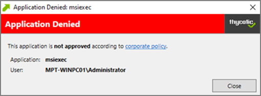

Example of Custom Notification:

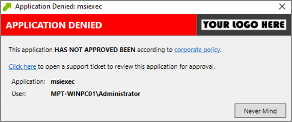

## Enable View as XML

To edit the message text the __View as XML__ button has to be enabled in your console. 

1. Navigate to and click your user icon, select __Preferences__.
1. Verify __Show ‘View XML’ Button__ is set to __Yes__, if set to No change the switch.

   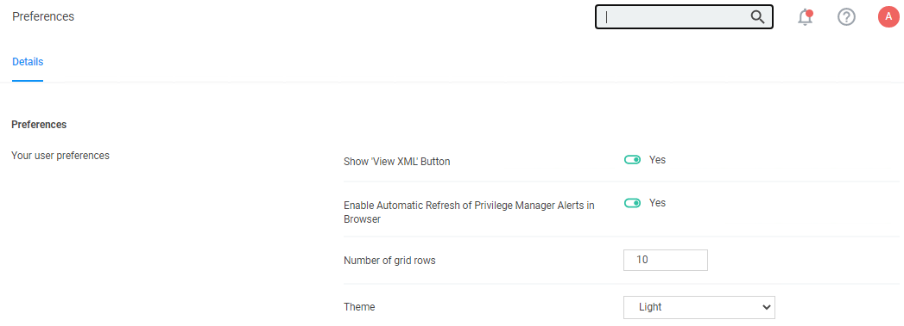
1. Click __Save Changes__.

## Customizing the Application Denied Notification Action

Default Actions shouldn't be edited directly, however Privilege Manager default items can be copied for customization purposes.

1. In the top Search box enter Application Denied Notification Action.
1. Click on the name of the Action __Application Denied Notification Action__.

   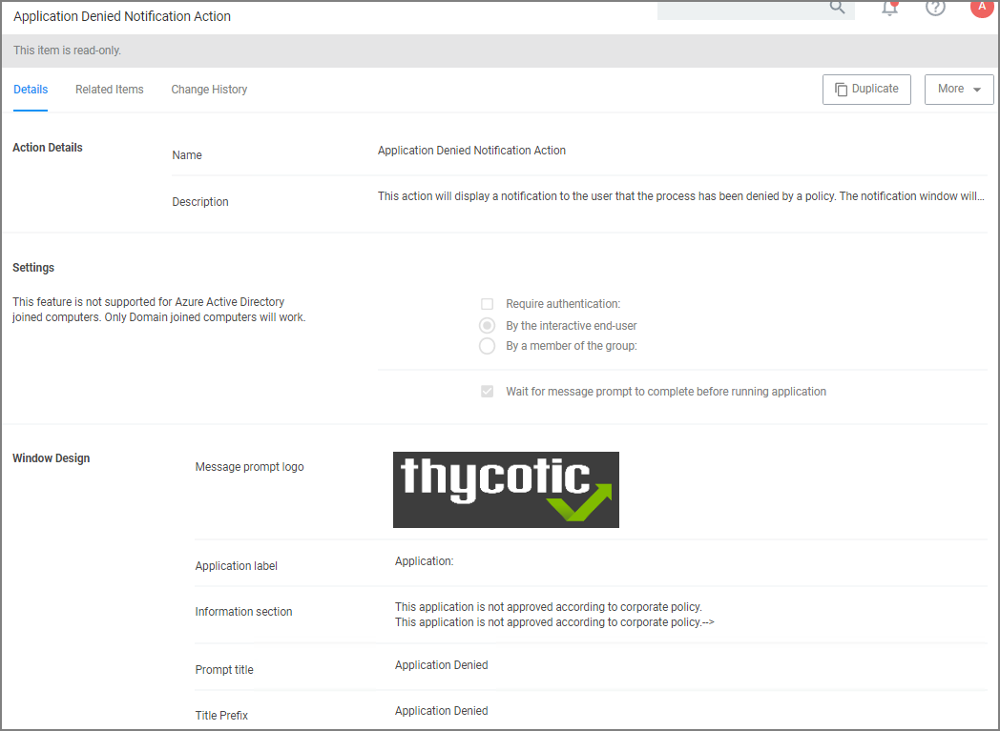
1. Click __Duplicate__.
1. Enter a customized and meaningful name for the action. It is recommended to use standard naming conventions with your custom items. Beginning custom names with your company name is a great way to differentiate between the default items and your custom items.

   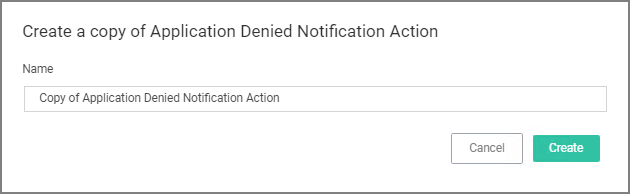
1. Click __Create__. Once you click Create, the new action page opens.
1. To upload a custom image file click __Choose File__. You can upload a custom logo, the file size should be under 128 KB and the width should be 500 pixels or less with a maximum hight of 34 pixels.

   The logo that is uploaded should NOT be a high-resolution image. This image will be delivered to every endpoint with every message in which it’s used. The smaller the image, the better, for sending the message to the endpoints and for the endpoint to load the message.
1. Click __Save__.

## Editing the Text in the UI

Privilege Manager makes it very easy to edit the text of a message. The fields are listed in alphabetical order on the item’s view page. Compare each field to this overview image:

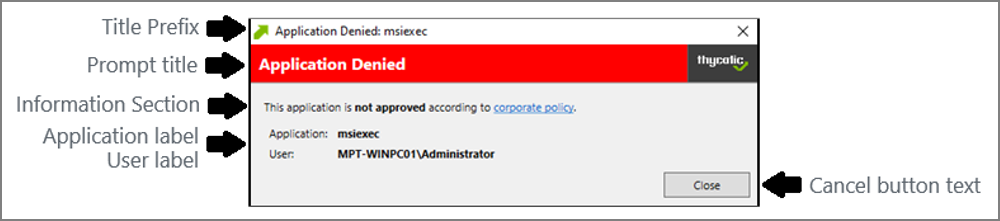

Most of the lines do not include individualized stylings per line. Editing the text in the UI will simply edit the text as required. The __Information Section__ field includes html formatting for the hyperlink to the corporate policy. That hyperlink will be removed if the text is edited on the message’s edit page.

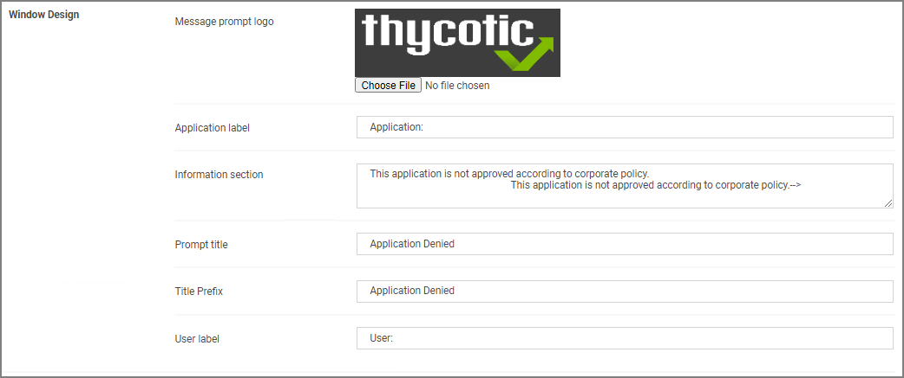

>**Note**: It is __NOT__ recommended to edit the Information Section directly on the message’s edit page. Instead, editing the Information Section via XML retains the html formatting for this line.
If no changes are made to the Information Section, the html formatting is retained. All other fields can be changed except the Information Section and the html formatting for the Information Section is retained.

## Editing the Text via XML

1. Select __More__ an click __View as XML__.

   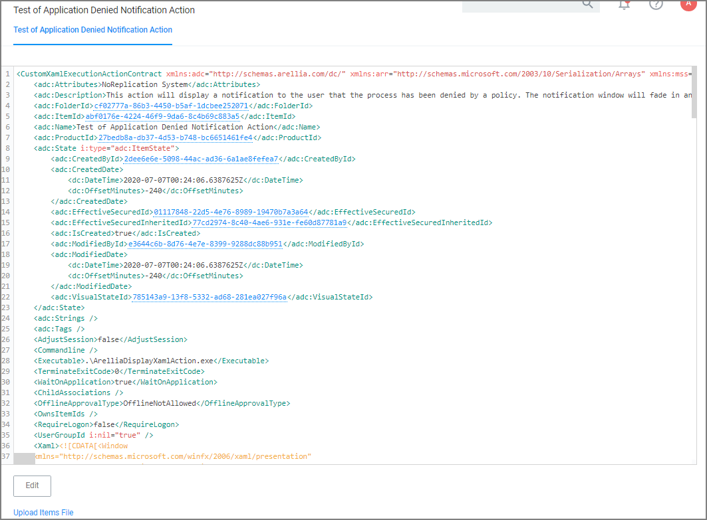
1. Change the notification text in the XML viewer:
   <!--TODO: Verify line numbers are still correct -->
   Line 82 has the following:

   ```xml
   <Paragraph><Run>This application is </Run><Bold><Run>not approved</Run></Bold><Run> according to </Run><Hyperlink TargetName="_blank" NavigateUri="http://www.example.com/policy"><Run>corporate policy</Run></Hyperlink><Run>.</Run></Paragraph>
   ```

   Edit this space with the URL and the name of the Hyperlink you would like for your pop up Window.

   ```xml
   <Paragraph><Run>This application HAS NOT BEEN APPROVED according to </Run><Hyperlink TargetName="_blank" NavigateUri="http://www.example.com/policy"><Run>corporate policy.</Run><Run>Click here, </Run><Hyperlink TargetName="_blank" NavigateUri="http://www.thycotic.com/helpdesk"><Run>to open a support ticket for review this application for approval.</Run></Hyperlink><Run>.</Run></Paragraph>
   ```
1. Change the default timeout:

   If you wish to change the default time out for how long the Deny Notification stays up (default is 6 seconds), edit Line 299:

   ```xml
   <i:Interaction.Triggers>
   <i:EventTrigger EventName="Loaded">
   <adx:InvokeCommandWithDelayAction x:Name="CloseAction" Command="{BindingCloseCommand}" Delay="00:00:06" />
   </i:EventTrigger>
   </i:Interaction.Triggers>
   ```

   To change it to 15 seconds, edit this elements delay parameter to 15:

   ```xml
   <adx:InvokeCommandWithDelayAction x:Name="CloseAction" Command="{BindingCloseCommand}" Delay="00:00:15" />
   ```
1. Click __Import__. If you get an error, please address your changes. Errors are indicated with a red dot. Save any edits when resolving errors.

## Updating the Policy with the new Action

After creating a custom notification action, the policy using the default notification needs to be updated.

1. Navigate to __Application Policies__ and locate the policy that uses the notification you wish to update.
1. Go to the __Actions__ section.

   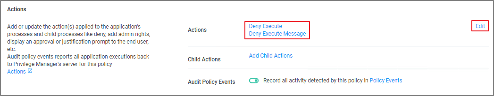
1. Click __Edit__.
1. Search for the action you just duplicated and modified.

   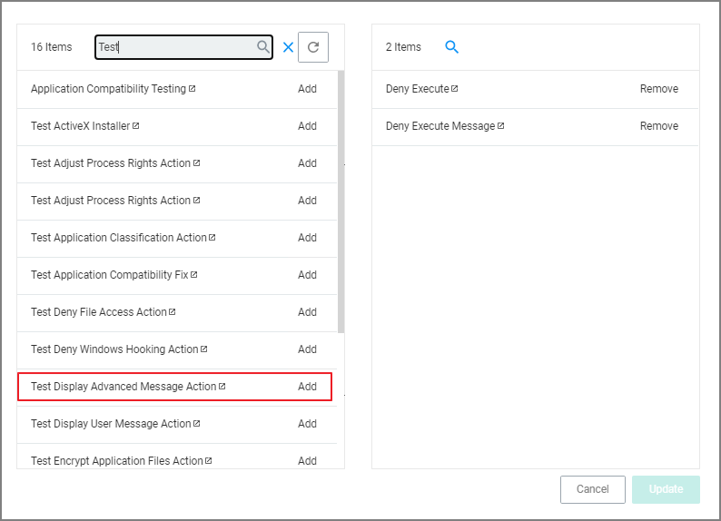
   1. Click __Add__, to add the action to the right pane of the dialog.
   1. Click __Remove__ for the old action used previously.
1. Click __Update__.

   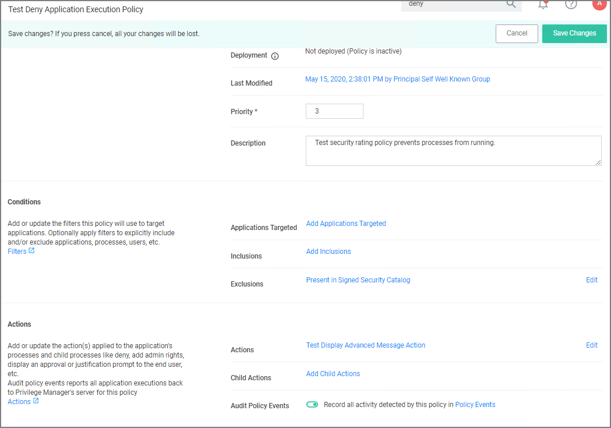
1. Click __Save Changes__.

Policy changes are automatically propagated to the endpoints. Note, that this might not be instantaneous based on the refresh cycle.
