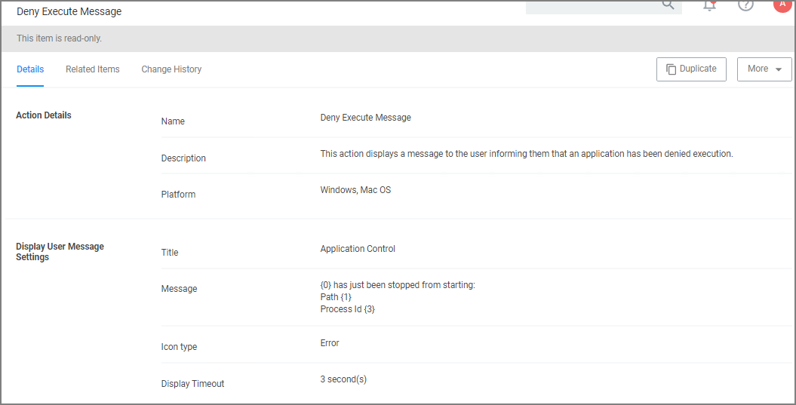
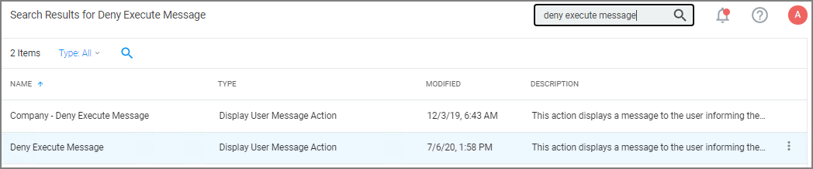
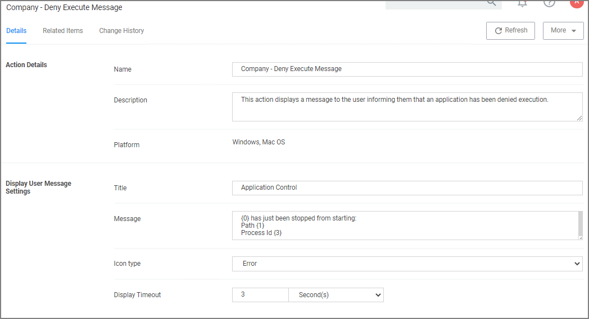

[title]: # (Deny Execute)
[tags]: # (message)
[priority]: # (3)
# Deny Execute Message

The Deny Execute Message does not include company branding and is easy to edit in the Privilege Manager console. The default of this basis user message action is displayed like this:

## Customization

1. In Privilege Manager, search for the default message that will be customized. In this example, we search for the default __Deny Execute Message__. 
1. Select the item from the search results.

   
1. This is a read-only action, to customize the default message, users need to use the __Create a Copy__ option.

   
1. Click __Duplicate__.
1. Enter a name for the new message action. It is recommended to use standard naming conventions with your custom items, e.g. beginning custom names with your company name is a great way to differentiate between the default items and your custom items.
1. Click __Create__.
1. Customize the Title and Message, use the Icon Type drop-down to specify the type, and set the Display Timeout.

   
1. Click __Save Changes__.
