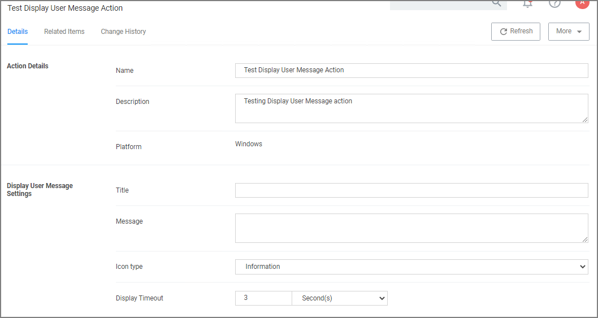

[title]: # (Display User Message)
[tags]: # (action)
[priority]: # (3)
# Display User Message Action

Display messages are paired with another action type. They are customizable and serve to tell the end user what is happening and why. Advanced messages pop up in the middle of the screen, whereas Basic User messages appear as smaller pop-ups directly from the taskbar area.

This action is available for both Windows and macOS systems.

## Parameters

The following Display User Message Settings can be specified:

* Title
* Message
* Icon type, which can be specified as Information, Warning, Error, Thycotic, or Program.
* Display timeout setting, which can be specified in Seconds, Minutes, Hours, Days, or Weeks.

## Examples

* [Deny Execute Message](deny-exe-msg.md)
