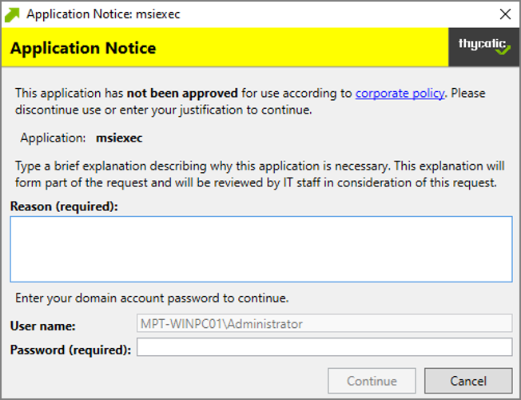
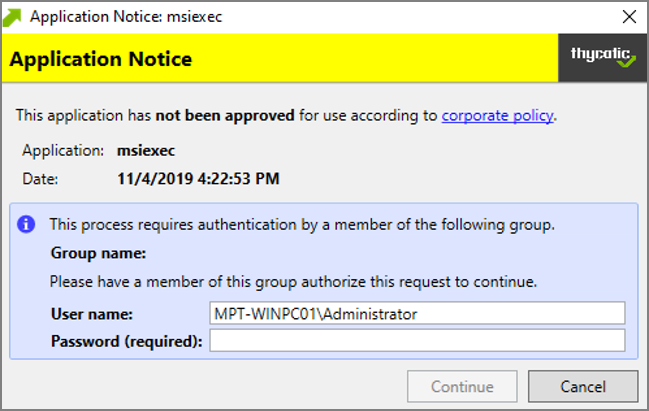
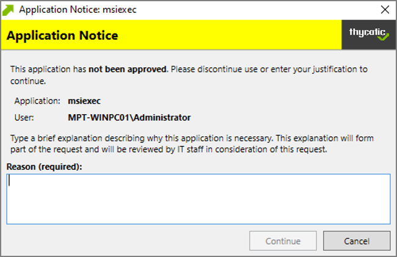
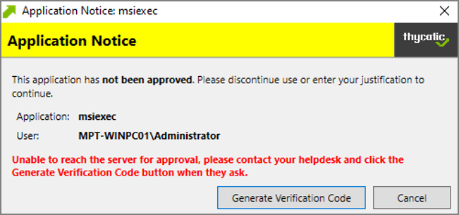
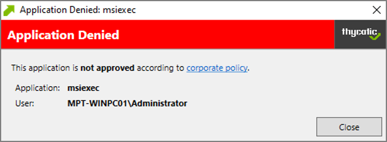
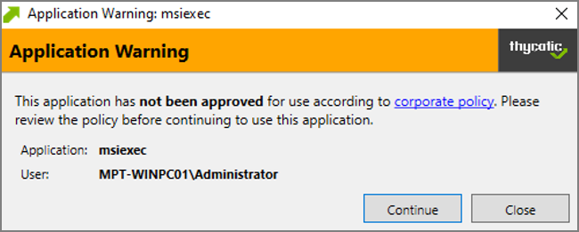
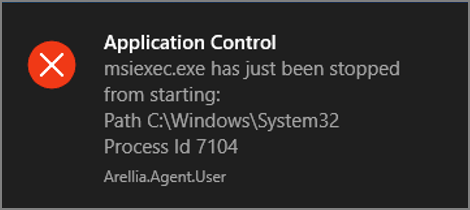
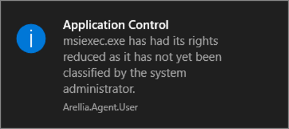

[title]: # (Message Actions)
[tags]: # (customization)
[priority]: # (2)
# Message Actions

Messages are the most common application action used in Privilege Manager. These messages are presented for end users on their endpoints. There are two kinds of messages:

* Basic, these display as smaller pop-ups directly form the taskbar area. They display and fade automatically. From the Action Type drop-down these are the [Display User Message](display-user-msg.md) actions for both Windows and macOS.
* Advanced, these messages display as a user dialog, requiring users to justify access to a certain application or to warn the user. Most of these messages require user interaction, but some can be set to fade in and out for the end user. From the Action Type drop down these are the [Display Advanced Message](display-adv-msg.md) for Windows and [Display Advanced User Message (MacOS)](../macOS/macOS-adv-msg.md) for macOS endpoints.

Both basic and advanced messages are useful for providing feedback to users that an application is being blocked, usage of the application is being logged, or any message that the end user should see.

## Basic vs. Advanced Messages

Basic messages briefly pop up from the end user’s task bar. They display like other Windows notifications, are shown on the screen, and then disappear without any user interaction required.

Basic messages do not include custom branding or logos. It is easiest to edit basic messages via Privilege Manager’s UI. However, the default message may suffice for some use.
Basic messages only display a message. These messages do not perform an action. For example, the basic Deny Execute Message should be used in conjunction with the Deny Execute action.

Advanced messages display as a new dialog, typically in the center of the screen, and usually require an interactive action from the end user – entering a justification, enter credentials, waiting for approval, selecting a continue or cancel button, etc.

Advanced message actions are used for justification and approval policies.
The ‘Application Denied Notification Action’ is the only default advanced message that does not require an interactive action from the end user. While this message has a cancel button to remove the message, this message will fade from the user’s screen after a short period of time.

Advanced messages include branding, which can be customized. Some fields are recommended to edit in the XML instead of the UI. These details are expanded in the section on Customizing Advanced Messages.

## Types of Advanced Message Actions

There are three categories of advanced messages:

* Advanced Feedback Messages – require information from the end user.
* Approval Request Messages – require information from the end user and approval from the application support team.
* No Required Input Messages – display information to the end user, but do not require information from the end user. May require a button push to clear the message.

### Advanced Feedback Messages

Advanced feedback messages require users to justify their need to use an application.

#### Authentication Justification Message Action

This action will display a customized message to the user, allowing for feedback and requiring authentication before running an application.

#### Group Member Authenticated Message Action

This action will display a customized message to the user and requires authentication by a member of the specified group if the end-user is not a member.
This process is also known as an over-the-shoulder request, meaning that the end-user will have to get their boss or a member of a specific domain user group to approve the request.

#### Justify Application Elevation Action

This action will display a justification prompt to the user before allowing the application to run.
The Justify Application Elevation Action is to be used with the User Requested Run As Administrator filter in an application control policy. This action collects information from users and creates reports on the server for approval requests.

#### Justify Application Message Action

This action will display a justification prompt to the user before allowing the application to run. It is used to collect information from users and create reports on the server with reasons why a user was running an application that hasn't been approved or denied yet.

### Approval Request Messages

The approval request messages are similar to the justification messages because they both gather feedback from end users and report it in the Privilege Manager console. Approval request messages also allow for end-users to see a waiting screen until their request has been either approved or denied.

#### Approval Request Form Action

This action will display a customized message to the user, allowing for feedback and requiring authentication before running an application.

#### Approval Request (with Offline Fallback) Form Action

This action displays an approval request form before allowing the application to run. These messages will then show a waiting screen until the request is either approved or denied by the appropriate Privilege Manager user/admin. With this advanced message, the same dialogue box as the Approval Request Form Action will appear:

If the machine is offline or can’t connect to Privilege Manager to upload the request, another dialogue box will then appear to prompt the end user to contact the helpdesk and generate a verification code:

### No Required Input Messages

No required input messages differ from the advanced feedback message actions because they do not require a justification to continue. End users need only acknowledge the displayed message. This feature requires that the Microsoft .Net Framework is installed on client machines.

#### Application Denied Message Action

This action stops an application from being launched and will display a notification of denial to the user attempting to run a process controlled by a policy.

#### Application Denied Notification Action

This action will display a notification to the user that the process has been denied by a policy. The notification window fades in and out automatically and will close after a defined period of time.

#### Application Warning Message Action

This action will display a warning to the user before allowing the application to run.

## Types of Basic Messages

### Deny Execute Message

This action displays a message to the user informing that an application has been denied execution. The Deny Execute Action needs to be used with this message.

### Deny Files Read and Write Access Message

This action displays a message to the user informing that an application will be restricted from certain file access. The Deny Read/Write Access to Microsoft Office Document Files Action needs to be used with this message.

### Windows Hooking Message

The action displays a message to the user informing them that an application will be stopped from interacting with other applications. The Deny Windows Hooking Action should be used with this message.

### Limit Process Rights for New Applications Message

This action displays a message to the user informing that an application has had its rights reduced. The Remove Administrator Rights or Remove Advanced Privileges Action needs to be used with this message.

### Remove Rights Message

This action displays a message to the user informing them of an associated action. The Remove Administrative Rights Action or Remove Advanced Privileges Action should be used with this message.

### Quarantine Message

This action displays a message to the user informing that an application has been quarantined. The File Quarantine Action should be used with this message.

