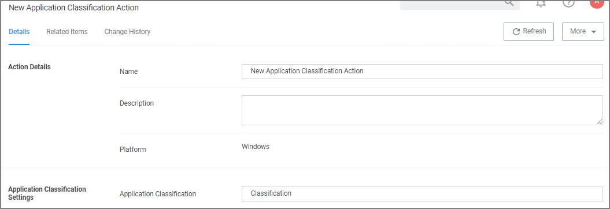

[title]: # (Application Classification)
[tags]: # (action)
[priority]: # (5)
# Application Classification Action

This type of action will restrict applications from modifying certain items and will enforce standard Windows ACLs when the targeted application accesses restricted files, folders, registry keys, or services on a computer.

