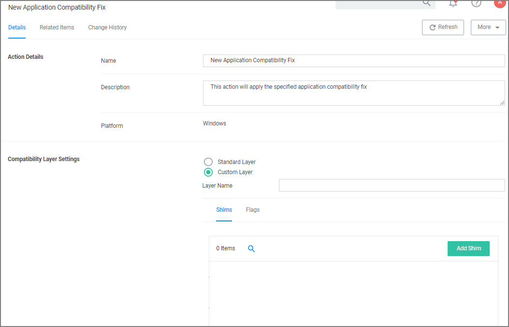

[title]: # (Apply Application Compatibility)
[tags]: # (action)
[priority]: # (5)
# Apply Application Compatibility Fix Action

This type of action will allow old applications that must be run via compatibility mode to execute  without manual compatibility adjustments.

## Parameters

The following Compatibility Layer Settings can be set on the Apply Application Compatibility Fix action:

* Custom vs. Standard Layer, which lets users select a layer either x86 and x64, x86 only, or x64 only.
* Shims
* Flags
