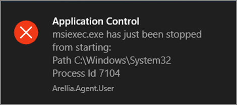

[title]: # (Deny Execute)
[tags]: # (action)
[priority]: # (5)
# Deny Execute Action

This action stops specific application from executing. It is a default action without any configurable settings. It is a read-only item.

## Deny Execute Message

This action displays a message to the user informing that an application has been denied execution. The Deny Execute Action needs to be used with this message.

