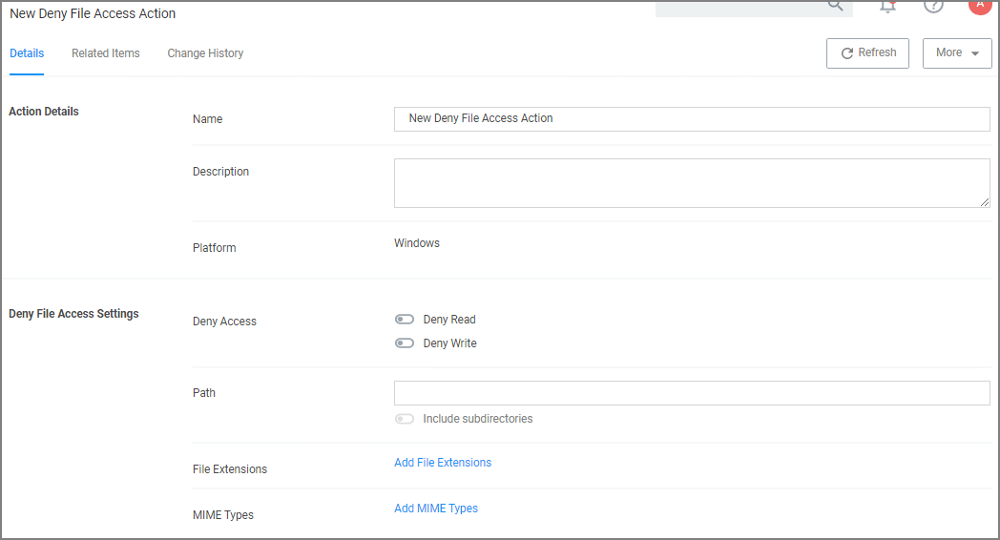

[title]: # (Deny File Access)
[tags]: # (action)
[priority]: # (5)
# Deny File Access Action

As the name suggests, this type of action will prevent applications from reading or writing (or both) to certain directories or to certain file types.

## Parameters

The following Deny File Access Settings can be specified:

* Deny Access to read and/or write operations.
* Path and possibly subdirectory locations.
* Specific file extensions.
* MIME types.

## Deny Files Read and Write Access Message

This action displays a message to the user informing that an application will be restricted from certain file access. The Deny Read/Write Access to Microsoft Office Document Files Action needs to be used with this message.

