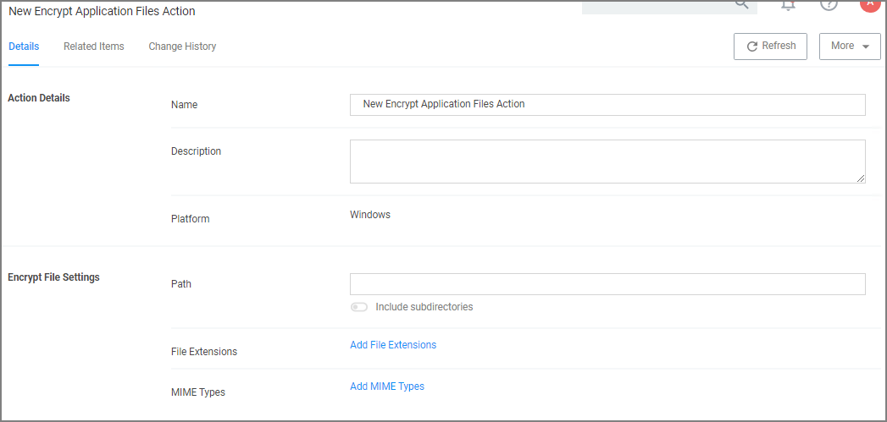

[title]: # (Encrypt Application Files)
[tags]: # (action)
[priority]: # (5)
# Encrypt Application Files Action

This type of action will force applications to use Microsoft encryption when saving a file.

## Parameters

The following Encrypt Application Files Settings can be specified:

* Path and the option to include subdirectories.
* File Extensions.
* MIME Types.
