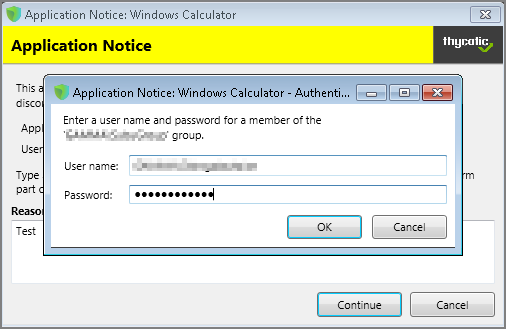

[title]: # (Endpoint Group Member Approval)
[tags]: # (action)
[priority]: # (5)
# Endpoint Group Member Approval Action

This action can be used for _over the shoulder_ approvals when systems are offline. The supervisor approves access by authentication on the user's endpoint system.

1. Navigate to __Admin | Actions__.
1. Click __Create__.
   1. On the __Create Action__ modal from the __Platform__ drop-down select __Windows__.
   1. From __Type__ drop-down select __Endpoint Group Member Authenticated Approval Action__.
   1. Enter a meaningful __Name__ and __Description__.
   1. From the __Approval Group__ drop-down, select the group membership of the approver.

      
   1. Click __Create__.

   
1. Under Settings verify the __Require approval by a member of the group:__ contains the correct group. If you ever need to change it, come back to this page and click the group name to access the change modal.
1. Navigate to your computer group's __Application Policies__, click __Create Policy__ or find an existing policy that you want to use for these approvals.
1. Under the __Actions__ section, search for and add the action you previously created.
1. Click __Save Changes__.
1. Click the __i__ next to __Deployment__ and select __Resource and Collection Targeting Update__ to immediately send the policy to your endpoint agents.

Policies also automatically update according to a schedule.

Sample Group Member approval notice with approval overlay:

Refer to the __Endpoint Group Member Authenticated Approvals__ report to view a history of "over the shoulder" approvals:

## Related Topics

* [Group Member Authenticated Message Action](group-member-approvals.md), which guides you through setting up approvals based on the group membership of the approver.
* [Using an Endpoint Group Member Authenticated Message Action](../config/foreign-systems/third-party/set-up-servicenow.md), which guides you through setting up _over the shoulder_ approvals that can be used in offline situations with a ServiceNow system integration.