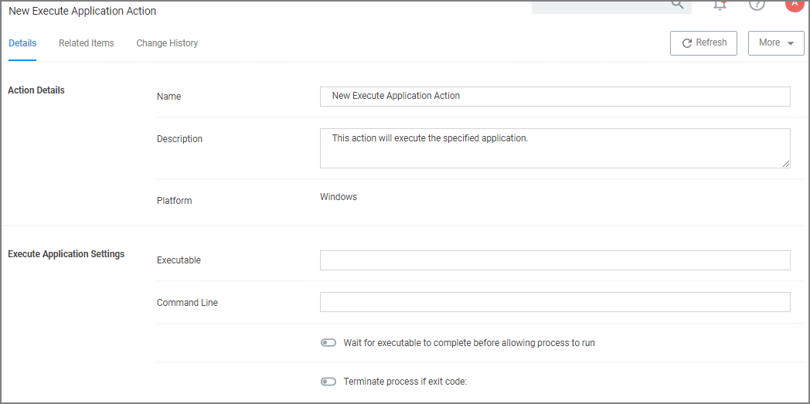

[title]: # (Execute Application)
[tags]: # (action)
[priority]: # (5)
# Execute Application Action

This type of action will execute another application and (optionally) wait on that process to complete before the original process can execute.

## Parameters

The following Execute Application Settings can be specified:

* an executable
* command line arguments
