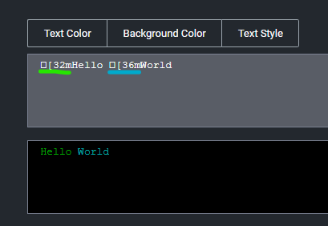

[title]: # (Actions)
[tags]: # (overview)
[priority]: # (1)
# Actions

In Privilege Manager, taking action is the name of the Application Control game.
Once you know how to accurately identify events via filters, the next crucial step in policy creation is to make stuff happen by applying specific actions to your filtered targets. This begs the question: what actions are possible to perform in Privilege Manager?

The most popular and well-known action categories in Application Control include:

* __Blocking Actions__ - Blocking an application simply means: deny it, or prevent it from running.
* __Monitoring Actions__ - This is a category of actions that can be applied to unknown applications that attempt to run. Sandboxing is another term often linked to monitoring, because you can create policies that link to reputation checking tools (like VirusTotal) to perform smart actions once an unknown file's reputation has been verified.
* __Elevation Actions__ - Allowing an application to run (allow listing) is good and well for trusted programs, but many trusted applications also require a higher credential set than your end users normally have access to. The elevation action category will allow an application to run with elevated permissions so any user can, for example, install that trusted HP printer on your network without taking time out of a HelpDesk employee's day. Implementing elevation policies allow "Least Privilege" to be implemented by your organization, eliminating the need for local users to have full administrator access on their computer.
* __Workflow Actions__ - Some actions explicitly enforce an organization's workflow system. The big example here is the “Request Access” action that will prompt a user for the reason they are trying to access an application for verification purposes and auditing.
* __Display Message Actions__ - Display messages are paired with one of the action types listed above. Display Message Actions are customizable and serve to tell the end user what is happening and why.

For a more complete (and more specific) list of all out-of-the-box Privilege Manager actions and types of actions, see the [List of Default Actions](default-actions.md) topic.

## Creating a New Action Manually

1. Navigate to __Admin | Actions__ in Privilege Manager and click __Create Action__.
1. From the __Platform__ drop-down, select either Mac OS, Unix/Linux, or Windows.

   
1. From the __Type__ drop-down, select the action type.
1. Name your new action and type a Description, then click __Create__.

   Editing options for actions depend on the type of action selected from the drop-down.

   

## Using the Command Line Action Editor

Command Line Action types have a built-in text editor to customize the user experience.

The administrator can customize the
* Text Color
* Background Color
* Text Style.

By default the background and foreground colors will be based on the user's terminal configuration settings. You can use __Text Style | Reset__ to reset to defaults at any point.

The text color can be changed and any color/style customization applies to all text after the specific ANSI control character has been inserted.

Click [here](https://en.wikipedia.org/wiki/ANSI_escape_code) for a deep dive on ANSI control codes.
