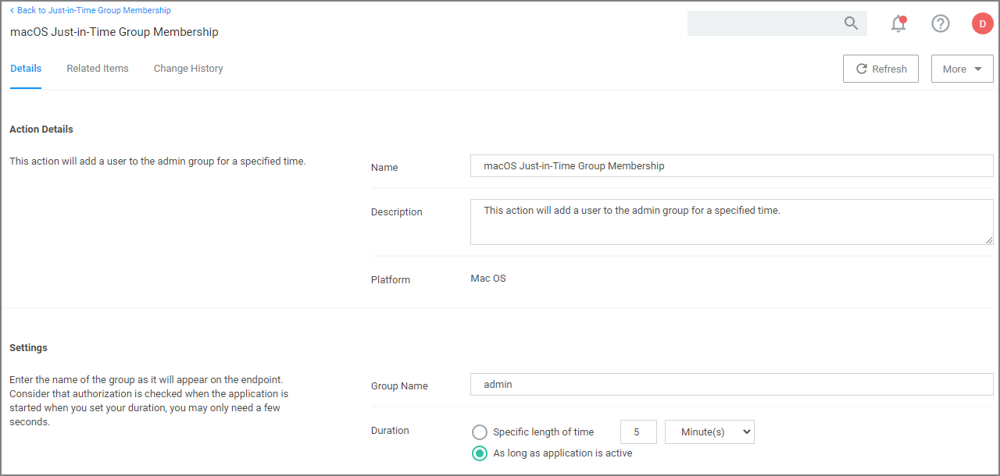

[title]: # (JIT Group Membership)
[tags]: # (action,macOS)
[priority]: # (5)
# Just-in-Time Group Membership Action

This action will add a user to a group with admin rights for a specified time. This action can then be added to a controlling policy to give Just-in-Time elevation to a user. The action is a read-only action by default. To customize this macOS action for your endpoints, use the __Duplicate__ option.

1. Navigate to __Admin | Actions__.
1. Search for and select __Just-in-Time Group Membership__ from the list of available macOS actions.
1. Click __Duplicate__.
1. Enter a name for your newly created action and click __Create__.

   
1. Under __Settings__ specify
   1. the __Group Name__ as created on the endpoint.
   1. the __Duration__ either
      * set a specific length of time, here you need to consider that authorization is started when the application starts, or
      * use the default _as long as application is active_.
1. Click __Save Changes__.
