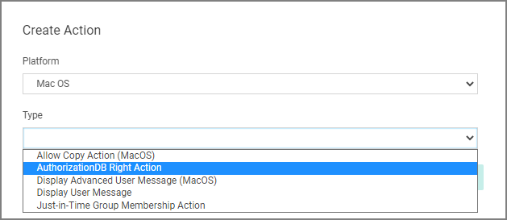
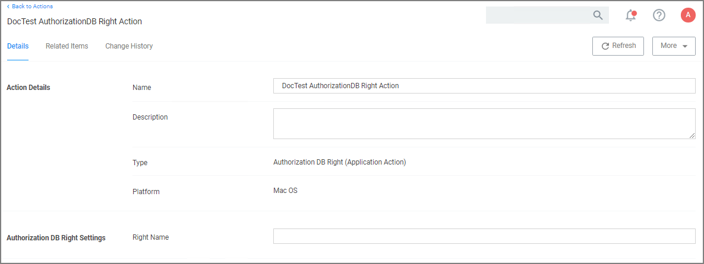

[title]: # (AuthorizationDB Actions)
[tags]: # (action)
[priority]: # (3)
# AuthorizationDB Right Actions

Privilege Manager provides the following default AuthorizationDB Right actions:

* Activity Monitor Kill Authorization Right (com.apple.activitymonitor.kill)
* Bless Helper Authorization Right (com.apple.ServiceManagement.blesshelper)
* Install Apple Software Authorization Right (system.install.apple-software)
* Modify System Keychain Authorization Right (system.keychain.modify)
* Xcode FLE Authorization Right (com.apple.dt.Xcode.LicenseAgreementXPCServiceRights)

Privilege Manager AuthenticationDB actions should not be used with advanced message actions such as Approval, Deny, Justification, or Warning should not be used in conjunction with this action.

## Creating a Custom AuthorizationDB Right Action

1. Navigate to __Admin | Actions__.
1. Click __Create Action__.
1. From the __Platform__ drop-down select __Mac OS__.
1. From the __Type__ drop-down select __AuthorizationDB Right Action__.

   
1. Enter a name, that allows you to easily identify the action for future use.
1. Click __Create__.

   
1. Under Authorization DB Right Settings in the __Right Name__ field enter the desired authorization database right name.
1. Click __Save Changes__.

The action can now be added to existing macOS elevation policies or selected at policy creation following the use of __Modify Authorization Right__ on the final create policy wizard page by selecting it from the __Right Name__ drop-down.

Refer to the following examples:

* [Elevating Xcode](../../../computer-groups/macOS/examples/elevate-xcode.md)
* [Elevating Modifying the Keychain](../../../computer-groups/macOS/examples/elevate-keychain.md)
* [Elevating Charles Proxy](../../../computer-groups/macOS/examples/elevate-charles-proxy.md)
* [Elevating Activity Monitor](../../../computer-groups/macOS/examples/elevate-activity-mon.md)
