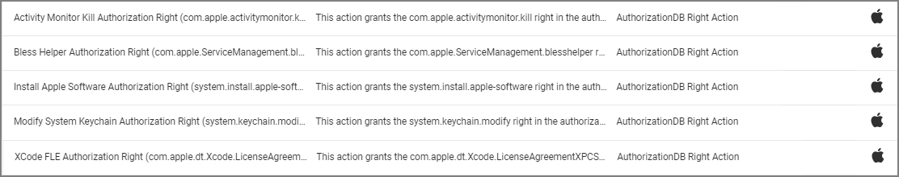

[title]: # (AuthorizationDB Actions)
[tags]: # (action)
[priority]: # (3)
# AuthorizationDB Actions

Privilege Manager provides the following default AuthorizationDB Right actions:

* Activity Monitor Kill Authorization Right (com.apple.activitymonitor.kill)
* Add to System Keychain Authorization Right (system.keychain.create.loginkc)
* Bless Helper Authorization Right (com.apple.ServiceManagement.blesshelper)
* Install Apple Software Authorization Right (system.install.apple-software)
* Modify System Keychain Authorization Right (system.keychain.modify)
* XCode Documentation Sets Authorization Right (com.apple.docset.install)
* XCode FLE Authorization Right (com.apple.dt.Xcode.LicenseAgreementXPCServiceRights)
​

Privilege Manager AuthenticationDB actions should not be used with advanced message actions such as Approval, Deny, Justification, or Warning should not be used in conjunction with this action.
