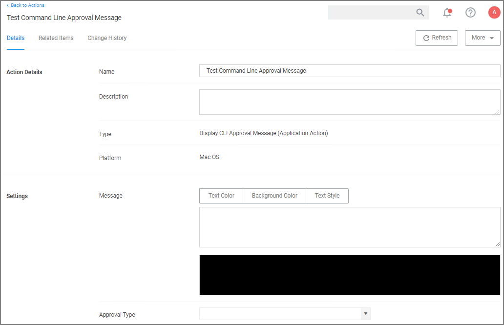

[title]: # (CLI Approval Message)
[tags]: # (actions,*nix)
[priority]: # (3)

# Command Line Approval Message Action

The Command Line Approval Message action allows administrators to prompt command line users on macOS endpoints for an approval request. The action displays a text in the command line interface and prompts the user to enter text.

This action is specifically designed to work with the Thycotic macOS sudo plugin and is only intended for commands that run under `sudo` based on the following use case:

* the user runs `sudo <command>`
* the user is prompted to supply a justification, which happens directly in the same terminal
* the command is then run with elevation

To create the message action,

1. Navigate to __Admin | Actions__.
1. Click __Create Action__.
1. For __Platform__, select __Mac OS__.
1. For __Type__, select __Command Line Approval Message__.
1. Enter a name and description.
1. Click __Create__.

   
1. Under __Settings__ for:
   * __Message__, use the color tooling options and editor to add and customize your message prompt for the users.
   * __Approval Type__, from the drop-down select either
     * __Default Execute Application Request Type__ or
     * __Default Offline Execute Application Request Type__.
1. Click __Save Changes__.

Refer to [Using the Command Line Action Editor](../index.md#using_the_command_line_action_editor) for information on how to use the editor.

>**Note**: The Command Line Approval Message action is the preferred message action to elevate commands and scripts run under `sudo` requiring approval.
