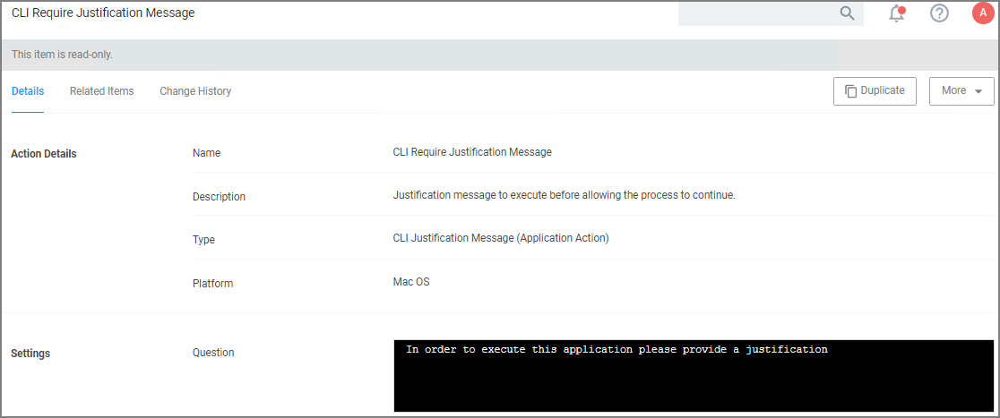

[title]: # (CLI Justification)
[tags]: # (action,macOS)
[priority]: # (3)

# CLI Require Justification Message Action

This message action prompts the user for a justification when using Terminal to execute commands and scripts under `sudo`. This action is specifically designed to work with the Thycotic macOS sudo plugin and is only intended for commands that run under `sudo` based on the following use case:

* the user runs `sudo <command>`
* the user is prompted to supply a justification, which happens directly in the same terminal
* the command is then run with elevation

To customize the default action select __Duplicate__. The action can be used in a policy without customization and works showing the default text.

>**Note**: The CLI Require Justification Message action is the preferred message action to elevate commands and scripts run under `sudo`.
