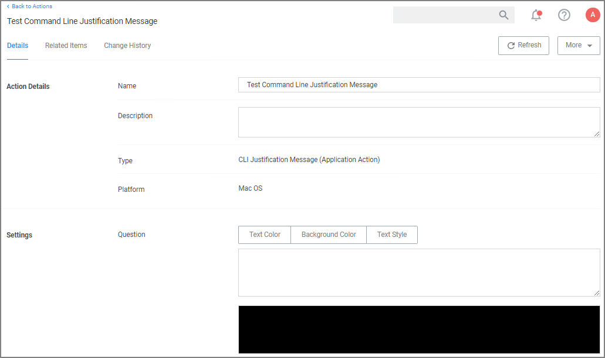

[title]: # (CLI Justification)
[tags]: # (action,macOS)
[priority]: # (3)

# CLI Require Justification Message Action

This message action prompts the user for a justification when using Terminal to execute commands and scripts via sudo. The action does not include any additional workflow process and is only meant to provide the prompt for the user to enter a reason for executing the action.

>**Note**: This message is different from the standard Advanced Justification Message Action that covers application execution not run from Terminal.

To customize the default action select __Duplicate__. The action can be used in a policy without customization and works showing the default text.
