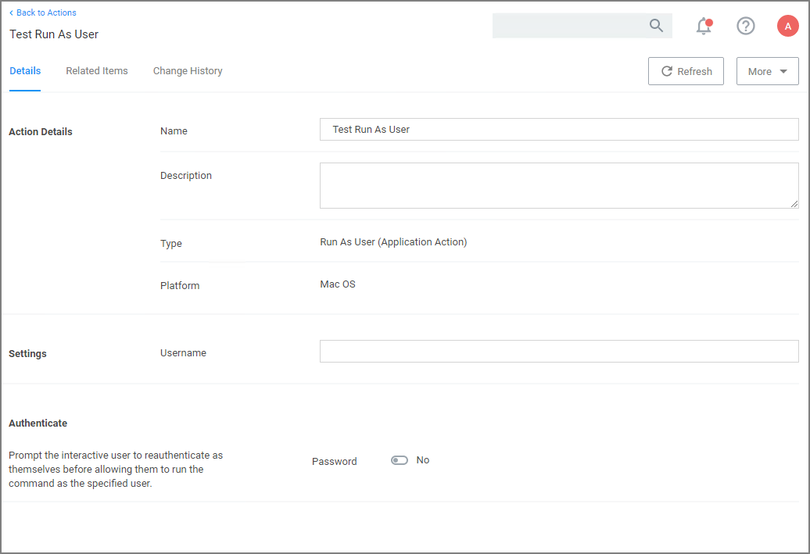

[title]: # (Run as User)
[tags]: # (action,macOS)
[priority]: # (3)

# Run as User Action

The action specifies the username of the account under which to run a command when invoked by 'sudo'.

For example, the `/usr/bin/id` command prints the current account's username. If a policy is created to match this command with an action that specifies a particular username, then entering "sudo id" will run the "id" command as that user and it will display that username.

The account must already exist on the endpoint, or `sudo` will display an error message and exit without running the command.

To create the message action,

1. Navigate to __Admin | Actions__.
1. Click __Create Action__.
1. For __Platform__, select __Mac OS__.
1. For __Type__, select __Run as User__.
1. Enter a name and description.
1. Click __Create__.

   
1. Under __Settings__ for __Username__, specify as which user to run the command.
1. Under __Authenticate__ you may change the switch to require a password. The default is to run the command as the specified user without prompting for a password.

   When the password prompt is enabled, `sudo` first prompts for the password of the __logged-in user__ before running the command as the specified user. In addition, the action can specify a time interval during which the user will not be re-prompted for their password when running the command targeted by the policy that contains the action. 
1. Click __Save Changes__.

## Time Interval Retention

By default, `sudo` retains the user's authentication for 5 minutes, but different actions can have different intervals. Continuing the example above, if the user runs `sudo -k` followed by `sudo id`, which clears the sudo credential cache, the `sudo` plugin resets the interval for any Run as User action active for that user. `sudo -k` followed by `sudo id` will prompt the user for their password regardless of whether the specified interval has passed, and it will apply to any other command governed by a run-as-user policy.
