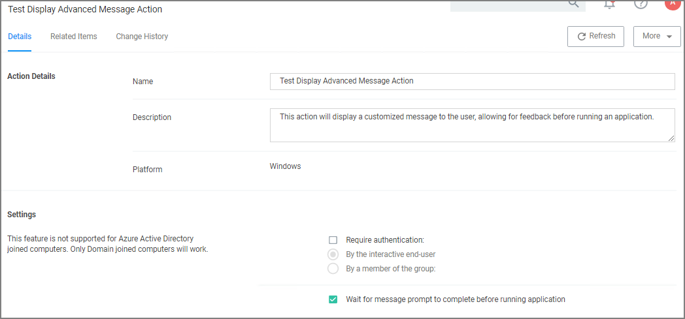
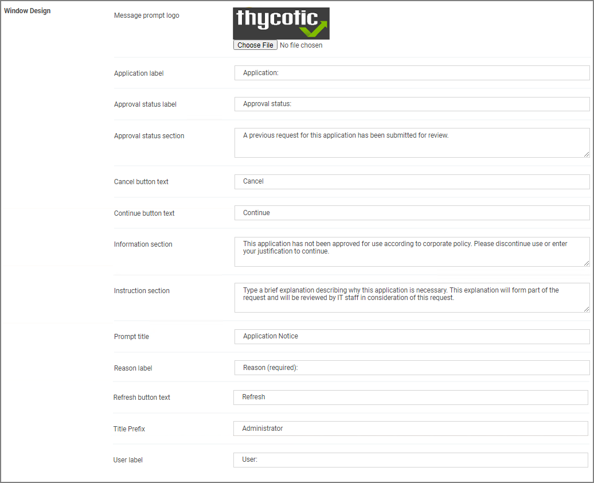

[title]: # (Display Advanced Message)
[tags]: # (action)
[priority]: # (4)
# Display Advanced Message Action

Display messages are paired with another action type. They are customizable and serve to tell the end user what is happening and why. Advanced messages pop up in the middle of the screen, whereas Basic User messages appear as smaller pop-ups directly from the taskbar area.

## Parameters

The following Display Advanced Message Settings can be specified:

* Require authentication.
  * By the interactive end-user
  * By a member of the group
  * Wait for message prompt to complete before running application

Further the Window Design parameters can be set. Those settings include customization of company logo for branding, label, status, button, instruction, prompt, and reason texts just to name a view.

## Examples

* [Create Custom Notifications](custom-app-denied-notification.md)
