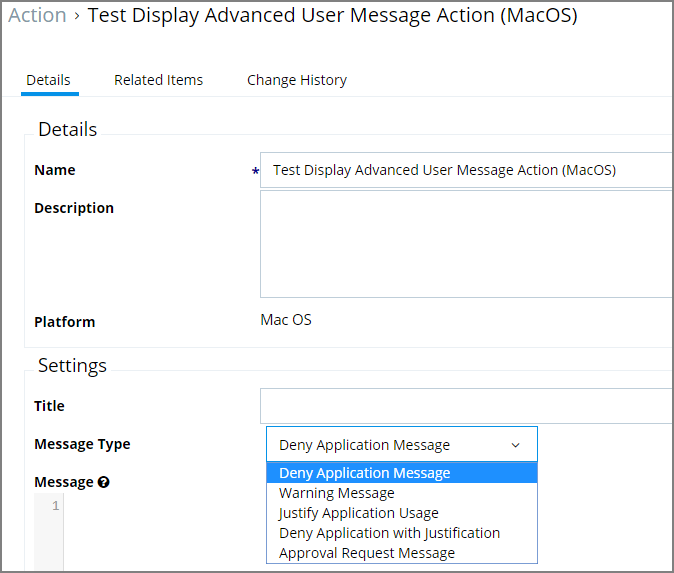

[title]: # (Display Advanced User Message)
[tags]: # (action)
[priority]: # (6)
# Display Advanced User Message Action (MacOS)

Display messages are paired with another action type. They are customizable and serve to tell the end user what is happening and why. Advanced messages pop up in the middle of the screen, whereas Basic User messages appear as smaller pop-ups directly from the taskbar area.

## Parameters

The following Display Advanced Message Settings can be specified:

* Title
* Message Type, such as
  * Deny Application Message
  * Warning Message
  * Justify Application Usage
  * Deny Application with Justification
  * Approval Request Message
* Message, which is the actual text of the message displayed to the user.
