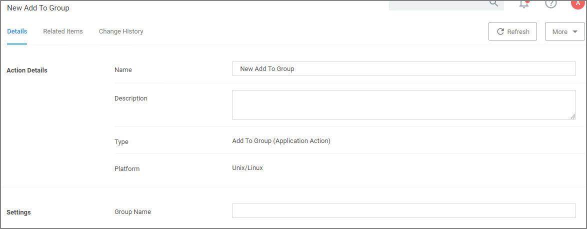

[title]: # (Add to Group)
[tags]: # (actions,*nix)
[priority]: # (3)
# Add to Group Action

The Add to Group action provides group membership to the running process via policy for temporary access.

## Settings

* Group Name: Specifies the Group Name for the temporary access.
