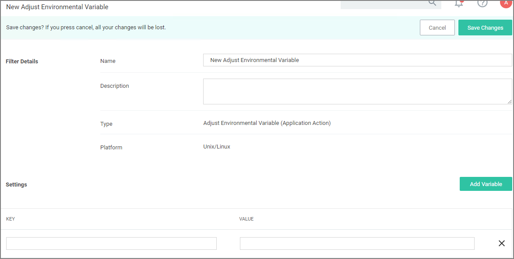

[title]: # (Adjust Environment Variable)
[tags]: # (actions,*nix)
[priority]: # (2)
# Adjust Environment Variable Action

The Adjust Environment Variable action is used to customize environment variables on an endpoint.

## Settings

* Add Variable: Administrators can add and/or edit one or more variable key:value combinations.
