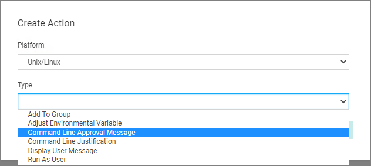
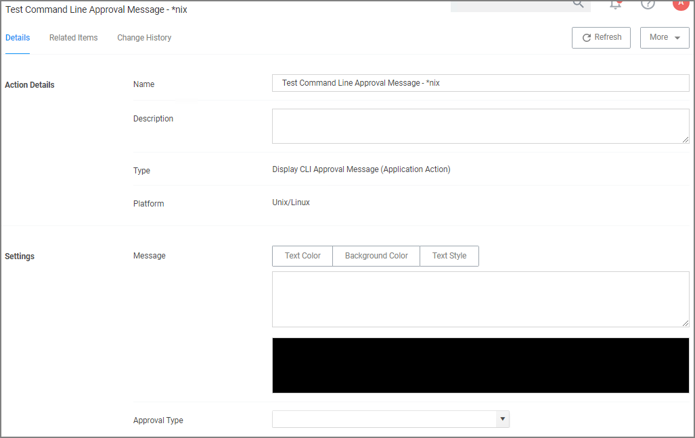

[title]: # (CLI Approval Message)
[tags]: # (actions,*nix)
[priority]: # (3)

# CLI Approval Message Action

The CLI Approval Message action allows administrators to prompt command line users on Unix/Linux endpoints for an approval request. The action displays a text in the command line interface and prompts the user to enter text.

To create the message action,

1. Navigate to __Admin | Actions__.
1. Click __Create Action__.

   
1. For __Platform__, select __Unix/Linux__.
1. For __Type__, select __Command Line Approval Message__.
1. Enter a name and description.
1. Click __Create__.

   
