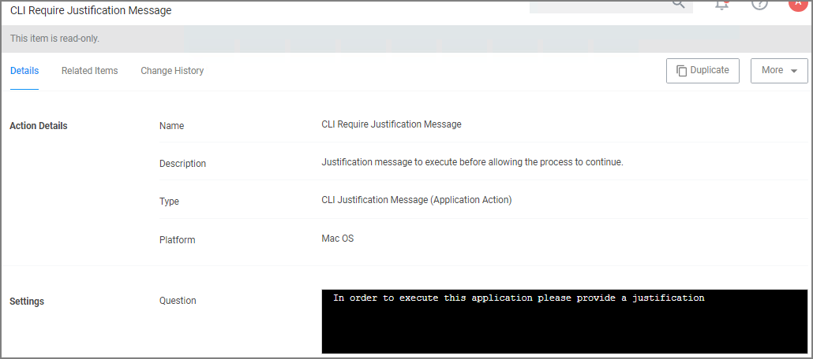

[title]: # (CLI Justification Message)
[tags]: # (actions,*nix)
[priority]: # (3)
# Command Line Justification Message Action

The Command Line Justification Message action can be used to provide a customized multi-line justification question to the user.

1. Navigate to __Admin | Actions__.
1. Click __Create Action__.
1. For __Platform__, select __Unix/Linux__.
1. For __Type__, select __Command Line Justification Message__.
1. Enter a name and description.
1. Click __Create__.

   
1. Under __Settings__, use the color tooling options and editor to add and customize your message prompt for the users.
1. Click __Save Changes__.

Refer to [Using the Command Line Action Editor](../index.md#using_the_command_line_action_editor) for information on how to use the editor.