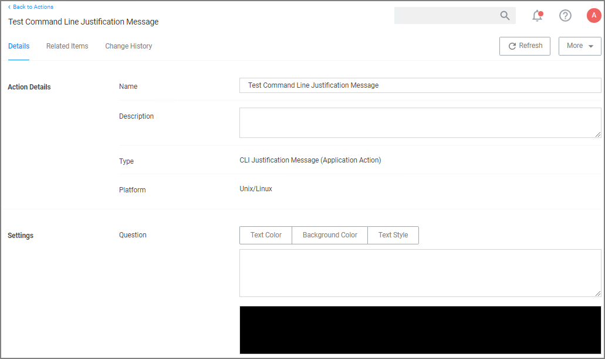

[title]: # (CLI Require Justification Message)
[tags]: # (actions,*nix)
[priority]: # (3)
# CLI Require Justification Message Action

The CLI Require Justification Message action can be used to provide a customized multi-line justification question to the user.

## Settings

* Question: Specifies the justification question for the user.
