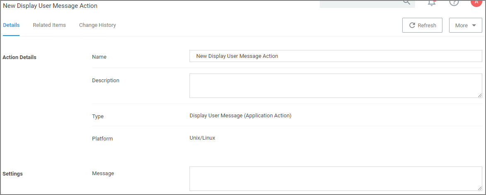

[title]: # (Display User Message)
[tags]: # (actions,*nix)
[priority]: # (3)
# Display User Message Action

The Display User Message action provides the option of a customized user message to be displayed to the user at an endpoint.

## Settings

* Message: Multi-line text field for a customized message to be displayed at an endpoint.
