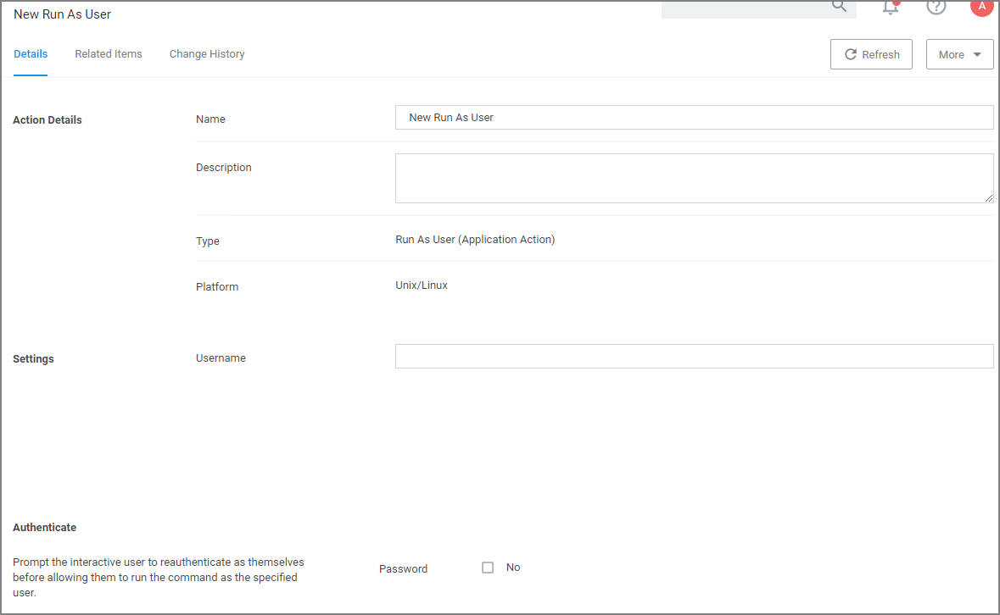

[title]: # (Run as User)
[tags]: # (actions,*nix)
[priority]: # (3)
# Run as User Action

This actions allows a command a user runs on an endpoint to be treated as if a different user ran it.

## Settings

* Username: This identifies the username under which to run the command at the endpoint.

## Authenticate

By default, the system requires the user to authenticate themselves, before they are allowed to run a command as the specified user. This can be changed by setting the password prompt to off, and thus disabling the reauthentication.
