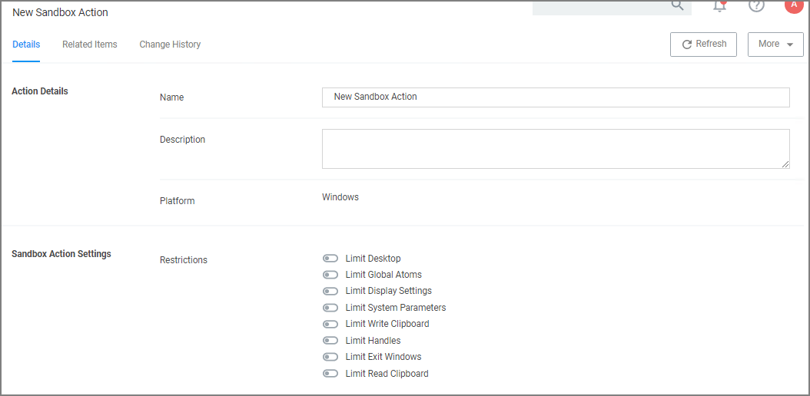

[title]: # (Sandbox)
[tags]: # (action)
[priority]: # (5)
# Sandbox Action

This type of action will limit the environments in which certain code can execute. The sandbox runs a process in a job object that limits its ability to interact with other processes, as well as limiting some specific types of interactions with the operating system.

