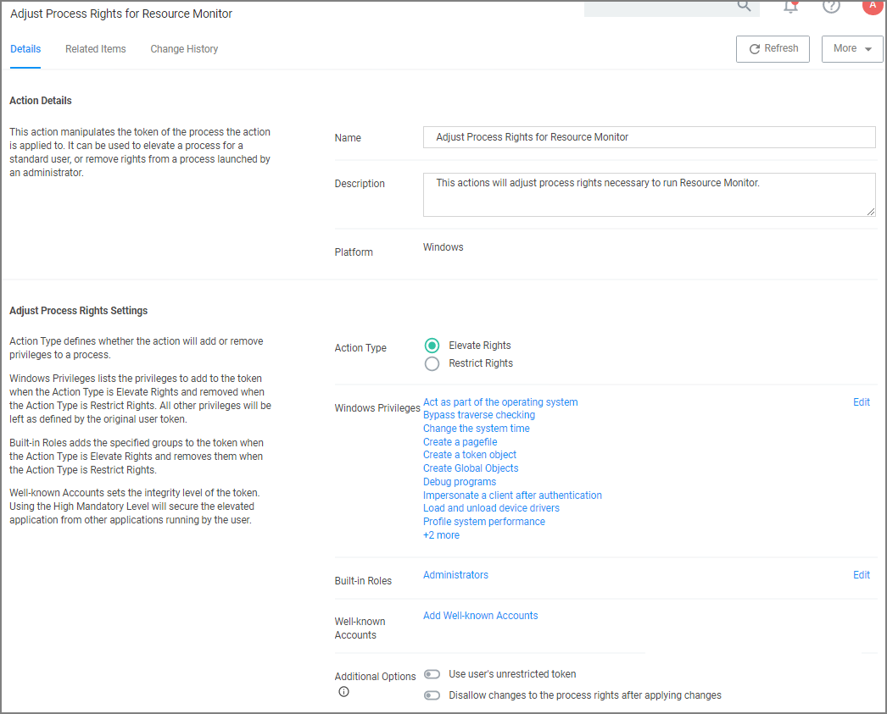
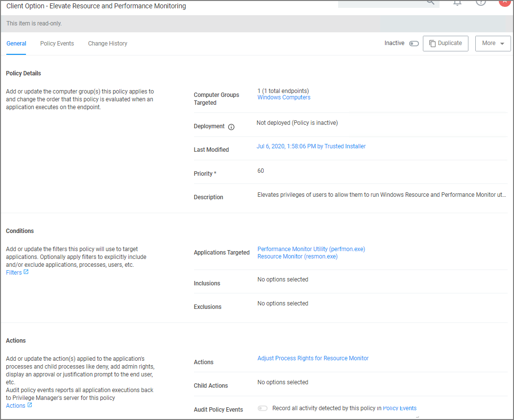

[title]: # (Adjust Process Rights)
[tags]: # (action,unrestricted token)
[priority]: # (4)
# Adjust Process Rights Action

This topic explains the Adjust Process Rights Action and Unrestricted Tokens in Privilege Manager.

When elevating process rights with Application Control Solution (ACS) on Windows, there are times when the rights given by ACS appear to be insufficient. The process still doesn't work as it does when the user is logged in as Administrator, accepts the UAC box, or the process is run with the right-click Run As Administrator option. Sometimes an error is returned stating insufficient rights to access.

Microsoft with the release of Windows Vista introduced changes to security which included creating two tokens for users when they log in. For more information refer to the [Microsoft Documentation on Restricted Tokes](https://docs.microsoft.com/en-us/windows/win32/secauthz/restricted-tokens).

The lower privilege token is the one always used unless the user goes through UAC or other processes. ACS allows administrators to choose which token should be used to elevate certain processes. The lower privilege token, if it works, is the better option as it has fewer privileges and thus protects the system better. But if necessary, the higher-privilege token can be used by ACS when manipulating the process's security configuration.

The following are the Privilege Manager default Adjust Process Rights Actions. As with all actions delivered with Privilege Manager, these actions cannot be modified. They can be copied and then customized and as many actions as
necessary can be created for a custom implementation:

* Add Administrative Rights
* Add Administrative Rights – Unrestricted
* Adjust Process Rights for Resource Monitor
* Remove Administrative Rights
* Remove Advanced Privileges Action

Each of those actions has by default Related Items associated, which need to be considered when customizing an action.

## Adjust Process Rights Action Settings Explained

The application action elevates or restricts the permissions and/or privileges held by a process security token. By default, each process inherits the user's security token.

The four main areas to customize are:

* Selecting an __Action Type__, which can either Elevate Rights or Restrict Rights. When the adjustment is a rights restriction, there is an advanced feature that allows you to apply restricted Security Identifiers (SIDs), which further restricts access to securable objects. More about this under the [What is a Restricted SID](#what_is_a_restricted_sid_) topic.
* Adding or Removing __Windows Privileges__, these come pre-populated with a set of default recommendations for each out of the box Action. To learn more about these Windows Privileges visit [Microsoft’s Documentation about User Rights Assignment](https://docs.microsoft.com/en-us/windows/security/threat-protection/security-policy-settings/user-rights-assignment).
* Adding or Removing __Build-in Roles__, these are the roles that provide file level access to a system and they are based on group membership.
* Adding or Removing __Well-known Accounts__, these are specifying the integrity levels at which processes can run. Also refer to [Microsoft’s Documentation about Mandatory Integrity Control](https://docs.microsoft.com/en-us/windows/win32/secauthz/mandatory-integrity-control).

### What is a Restricted SID?

A restricted ID is an access token that modifies a user's access to securable objects and controls a user's ability to perform various system-related operations on the local computer.

When a restricted process or thread tries to access a securable object, the system performs two access checks, using the

* token's enabled SIDs, and
* the list of restricted SIDs.

Access is granted only if both access checks allow the requested access rights.

#### When to use restricted ID

Use a restricted SID to further restrict the applications in the sandbox, which you can use as another method of monitoring. In other words, this is a way to protect yourself against unknown applications if you don't want to implement a blocking policy.

The restricted SID will allow only Read access to the user registry but not to the local machine registry. Also, restricted processes do not have rights to open any network-based resource, such as file servers. As a result, the restricted SID will be able to do very little and apps may not work correctly under this model. Ultimately, apps in the sandbox that have restricted SID applied to them will be severely locked down.

#### Using Apply Restricted SID

When you select Restrict Rights and then Apply Restricted SID, you add the Restricted SID to the process. When evaluating security for any operation, when there is any Restricted SID specified then not only does the Security Descriptor
need to allow access to the user, but explicitly to the Restricted SID.

### How to Add Windows Permissions

Windows permissions are specific OS based permissions to perform actions, like changing system time or taking ownership of a files vs. accessing securable resources. To learn more about these Windows Privileges visit [Microsoft’s
Documentation about User Rights Assignment](https://docs.microsoft.com/en-us/windows/security/threat-protection/security-policy-settings/user-rights-assignment).

### How to Use Well-known Accounts

In this area you will most likely specify either of the following:

* High Mandatory Level
* Low Integrity Level
* Medium Integrity Level
* Medium Plus Integrity Level
* Restricted Code Well Known Group
* System Integrity Level
* Untrusted Mandatory Level

These integrity levels determine who else can use a specific process. Processes launched by a standard user are by default medium integrity. Any process that gets launched via an elevated policy has a high integrity level assigned by
default.

Processes need to have level parity to be able to utilize each other. This means, if a process is running at a high integrity level and wants to inject code into another process, it can do so if that other process is running at
high, medium, or low integrity levels, but it cannot inject code into system level processes. Processes that run at low integrity levels can be utilized by pretty much any other process, but they cannot reach out to other processes.

New processes are always created with the minimum of the user integrity and file integrity levels. This guarantees that a new process never executes with higher integrity than the executable file.

#### Example Scenario

In Privilege Manager we can use these Well-known Accounts to set or remove level integrity independent of or in combination with any assigned elevation or blocking policies.

For example, Adobe applications are generally part of elevation policies in an organization. As mentioned before an elevation policy defaults to a high integrity level. Due to Adobe interoperability requirements within their product
suites and with processes launched by standard users, it requires medium integrity levels for all Adobe products.

Any elevation policy pertaining to Adobe products, needs an __Adjust Process Rights Action__ that sets the __Well-known Accounts__ setting to __Medium Integrity Level__.

## Additional Options Explained

Under Additional Options customers can select to __Use User’s Unrestricted Token__ and __Disallow changes to the process rights after applying changes__.

The use of the unrestricted token option is another level of available customization beyond what can be enabled or disabled via the Adjust Process Rights Settings. Enabling this token presents the user with extra levels of
access rights over the process. If changes to the process rights are disallowed, the user’s unrestricted token is valid as long as the pertaining process is running.

For example if you have a standard user policy for a certain process to run at medium integrity level, but you want to enable more rights without fully elevating and granting the process a high integrity level, you can use the unrestricted access token to fine tune.

### Enabling Unrestricted Token Use

To set the unrestricted token, follow these steps:

1. Select the action of type __Adjust Process Rights Action__ that best fits your specific business need.
2. Create a copy of that action.
3. Select the __Use User's Unrestricted Token__ checkbox on the copied action and save the action with a new name (for example "Unrestricted Token - Add Admin Rights").
4. Add the new action to new policies or change existing policies and remove the old action.
5. Add the new action and save the changes.
6. Then update the agent client policies.
7. The ACS agent must retrieve the details of the new action from the server via the ACS web service.
8. The change may take a few minutes to reach the client machine after the client policies have updated depending on how busy the server is.

## Adjust Process Right for Resource Monitor

The following image shows the default action. To customize make a copy to change any of the default items.

### Related Item - Policy

The following image shows the default related item policy for the above action. To customize make a copy to change any of the default items.

