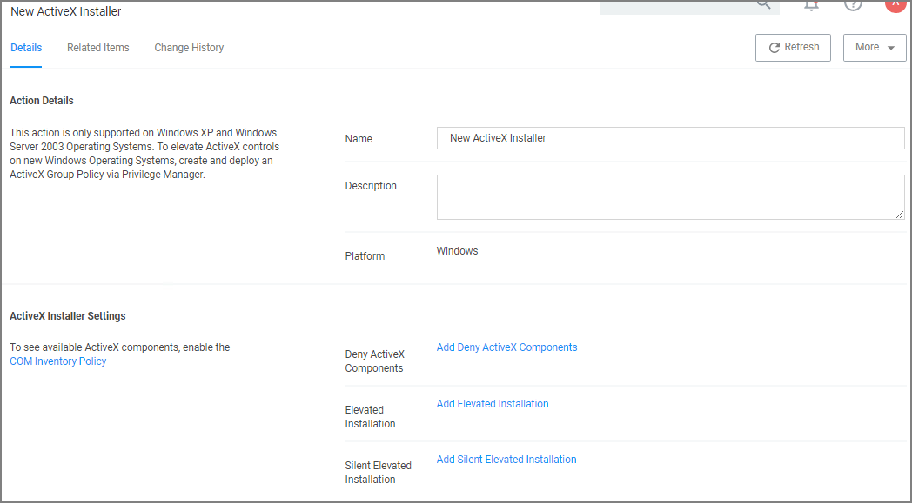

[title]: # (ActiveX Installer)
[tags]: # (action,win7)
[priority]: # (3)
# ActiveX Installer Action

This type of action is a specific use-case for older Windows systems (Windows XP and Windows Server 2003). The ActiveX installer action allows or denies an application to enable standard users to install approved ActiveX components. If you don’t know what ActiveX means, you won’t need to use this type of action.

## Parameters

The following details can be set on the ActiveX action:

* Deny ActiveX Components, or
* Elevated Installation, or
* Silent Elevated Installation

For those actions for ActiveX, these parameters can be specified:

* Scope by Organization Group
* Search text
* Maximum rows returned
* Resources (use the column filter function to locate a resource and click __Add__)
