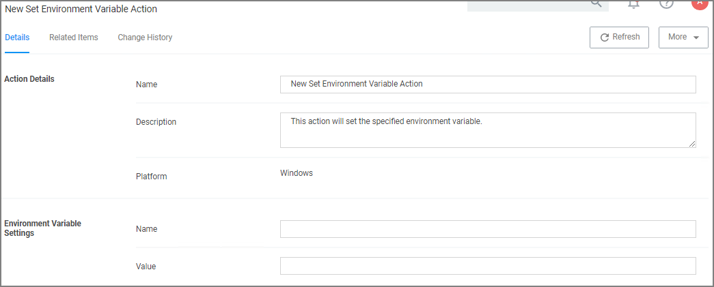

[title]: # (Set Environment Variable)
[tags]: # (action)
[priority]: # (3)
# Set Environment Variable Action

This type of action sets an environment variable for processes that could change the behavior of an  application, or be caught by an Environment Variable filter in another policy.

## Parameters

The parameters for the Set Environment Variable action are setting the name and value of the environment variable.
