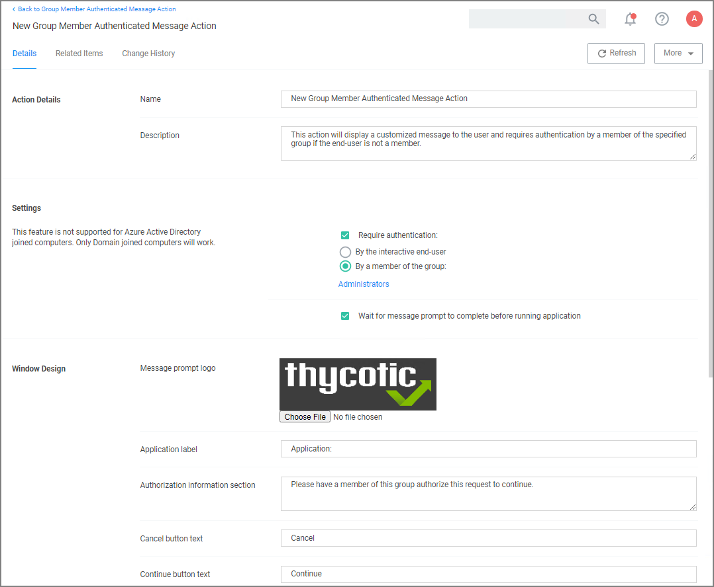

[title]: # (Group Member Approval)
[tags]: # (action)
[priority]: # (3)
# Group Member Approval Action

This action can be used for approvals that are based on a group membership authentication of the approver.

1. Navigate to __Admin | Actions__.
1. Search and select __Group Member Authenticated Message Action__.
1. Click __Duplicate__.
1. Name your new action and click __Create__.

   
1. Customize the Action based on your specific business requirements.
1. Verify the __By the member of the group:__ is active and a group is listed below the button. If you ever need to change it, come back to this page and click the group name to access the change modal.
1. Click __Save Changes__.
1. Navigate to your computer group's __Application Policies__, click __Create Policy__ or find an existing policy that you want to use for these approvals.
1. Under the __Actions__ section, search for and add the action you previously created.
1. Click __Save Changes__.
1. Click the __i__ next to __Deployment__ and select __Resource and Collection Targeting Update__ to immediately send the policy to your endpoint agents.

Policies also automatically update according to a schedule.

Related topics:

* [Endpoint Group Member Authenticated Message Action](endpoint-group-member-approvals.md), which guides you through setting up _over the shoulder_ approvals that can be used on- and offline.
* [Using an Endpoint Group Member Authenticated Message Action](../config/foreign-systems/third-party/set-up-servicenow.md), which guides you through setting up _over the shoulder_ approvals that can be used on- and offline with a ServiceNow system integration.
