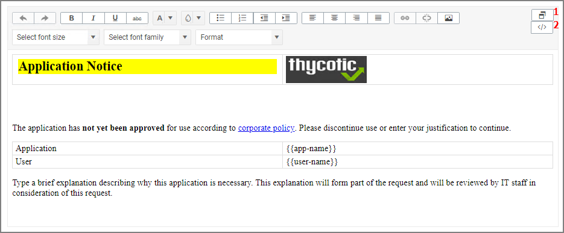

[title]: # (WYSIWYG Editor)
[tags]: # (action,macOS,message editor)
[priority]: # (6)
# WYSIWYG MacOS Action Message Editor

All macOS based Display Advanced Message Action types are supported via an WYSIWYG editor for user friendly editing of advanced message action text. Any HTML based message can be rendered by the Agent on the macOS endpoint.

The editor is currently available for the following actions:

* Application Approval Request (with Offline Fallback) Message Action
* Application Approval Request (with ServiceNow Request Item Number) Message Action
* Application Approval Request Message Action
* Application Denied Message Action
* Application Justification Message Action
* Application Warning Message Action

Actions are read-only and a duplicate needs to be created before any customized message action can be created. Once you create a duplicate, you will see the following under __Settings | Message__:

Where:

* [1] is the undock button, which allows you to edit the page in full-size view.
* [2] is the source toggle, which allows you to edit the HTML source for the message action.

The editor comes with various style element options to further simplify the message editing process.

Edit any of the message elements for your users on your endpoints, except for the app-name and user-name variables. Those are system derived.

>**Note**: You can upload a custom logo, the file size should be under 128 KB and the width should be 500 pixels or less with a maximum hight of 34 pixels.
>
>The logo that is uploaded should NOT be a high-resolution image. Consider that this image will be delivered to every endpoint with every message in which it is used. The smaller the image, the better, for sending the message to the endpoints and for the endpoint to load the message.
