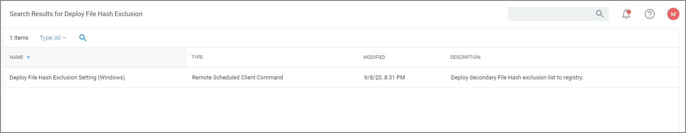
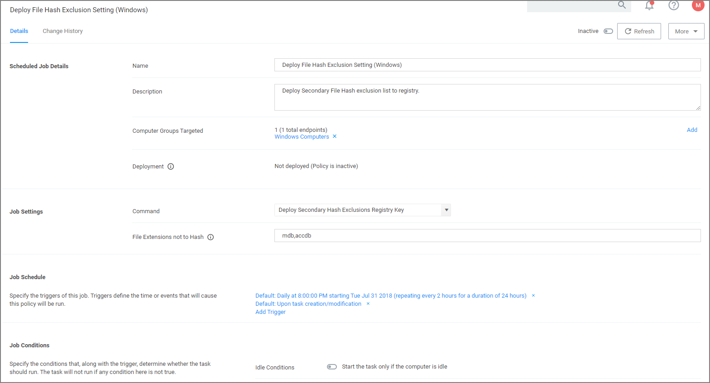

[title]: # (File Hash Exclusions)
[tags]: # (secondary file filters)
[priority]: # (8001)
# Exclude File Extensions during File Hashing

The Thycotic Application Control Agent collects the file hash of a new process and also the hashes of the child processes it runs. Sometimes non-executable file types cause execution issues during the hashing process. Via the downloadable Configuration Feeds, Thycotic offers a policy template that provides the ability to exclude certain file extensions from the hash process.

If non-executable files like xlsx, xls, mdb, and accdb for example cause execution issues, download the __Secondary  Hash Exclusions__ policy template. By default .mdb and .accdb are excluded from the file hashing procedure in Privilege Manager. To not overwrite default behavior, make them a part of your exclude list at all times.

Always manually test a new policy deployment on a single endpoint, and only push the solution to all desired endpoints after a successful verification on the test environment.

>**Note**:
>This feature requires a Thycotic Control Agent version of 10.5 or greater.

## Create File Exclusion through Config Feed

1. Navigate to __Admin | Config Feeds__ link.
1. Next to __Privilege Manager Configuration Feeds__ click __Select Items__.
1. Next to __Application Control Solution__ click __Select Items__.
1. Locate the __Application Control - Secondary Hash Exclusions__ and click __Download__.

   

   The policy template is being downloaded and installed.
1. Use __Search__ and type __Secondary Hash Exclusion__.
1. From the results list select the new policy __Deploy File Hash Exclusion Setting (Windows)__.

   
1. Under __Job Settings__ | __File Extensions not to Hash__ you can add to the list of extensions, for example xlsx, xls. By default _.mdb_ and _.accdb_ extensions are already listed.

   
1. Click __Save Changes__.

## Manually Test on Endpoint

To create manual secondary extension exceptions to file hash collection, add a registry key to the endpoint.

1. Open Registry Editor (regedit.exe) and navigate to

   ```
   HKLM:\Software\Policies\Arellia\AMS.
   ```
1. Create __New | String Value__

   1. Name: __SecondaryExtensionExclusions__
   1. Value: enter a comma-separated list of extensions to include, i.e. `xlsx,xls,mdb,accdb`.
1. Restart the Thycotic services on this machine.

Open a file matching an extension from your inclusion list and test if it works on this endpoint. If it works, create a Policy to push this registry key creation to all desired endpoints.
