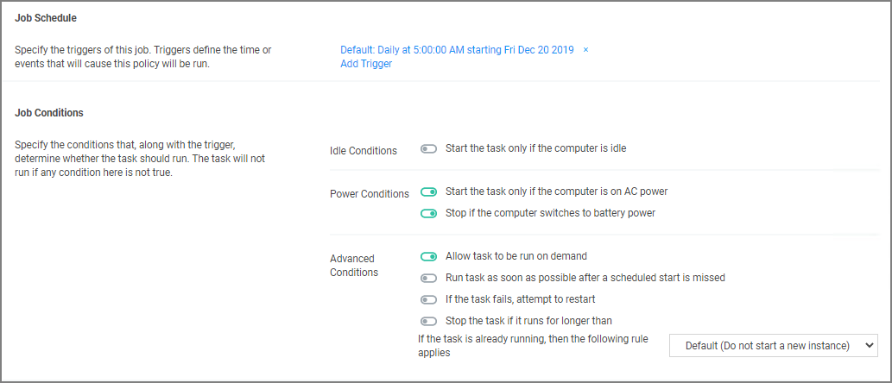

[title]: # (Ignoring macOS Updates)
[tags]: # (overview)
[priority]: # (8002)
# Ignoring macOS Updates

MacOS has a command-line utility that can be used to ignore specific software updates in the Software Update preference pane. To provide a way in Privilege Manager to ignore or reset ignored OS updates, the following policies are available via configuration feeds.

 

* The Ignore macOS Catalina Software Update (Mac OS) - The Ignore macOS Catalina Software Update (Mac OS) policy uses the Run Shell Script (Mac OS) command. By default, it is triggered to run Daily at 5:00:00 AM starting Fri Dec 20 2019, with default Targets specified as MacOS Computers.

* The Reset ignored macOS Softwares Update (Mac OS) - The Reset ignored macOS Softwares Update (Mac OS). uses the Run Shell Script (Mac OS) command. By default, it is triggered to run Daily at 5:30:00 AM starting Fri Dec 20 2019, with default Targets specified as MacOS Computers.

## Configuration Feeds

1. Navigate to __Admin | Config Feeds__.
1. Click on __Select Items__ for __Privilege Manager Product Configurations__.
1. Click on __Select Items__ for Application Control Solution.
1. Download both configuration feeds __Ignore macOS Catalina software update__ and __Reset ignored macOS software updates__.

## Enabling the Policies

Following the config feeds install, you need to enable the policy to ignore the update.

1. Navigate to your macOS Computer Group and click __Scheduled Jobs__.
1. Click on __Ignore macOS Catalina Software Update (Mac OS)__.

   
1. Set the __Inactive__ switch to __Active__.
1. Click __Save Changes__.

## Resetting the Policy

1. To reset the changes, set the ignore updates policy to inactive and save the changes.
1. Navigate to the __Reset ignored macOS Software Updates (Mac OS)__ policy.
1. Set the __Inactive__ switch to __Active__.
1. Click __Save Changes__.

## Scheduling

You can edit when the policy runs by scrolling down to the Job Schedule and Job Conditions section on the policy page.

>**Note**: Once the policies are enabled they do not run immediately. If you would like the policies to run right way you will need to click on the information icon next to Deployment and select the __Resource and Collection Targeting Update__ task.
