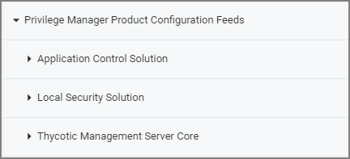
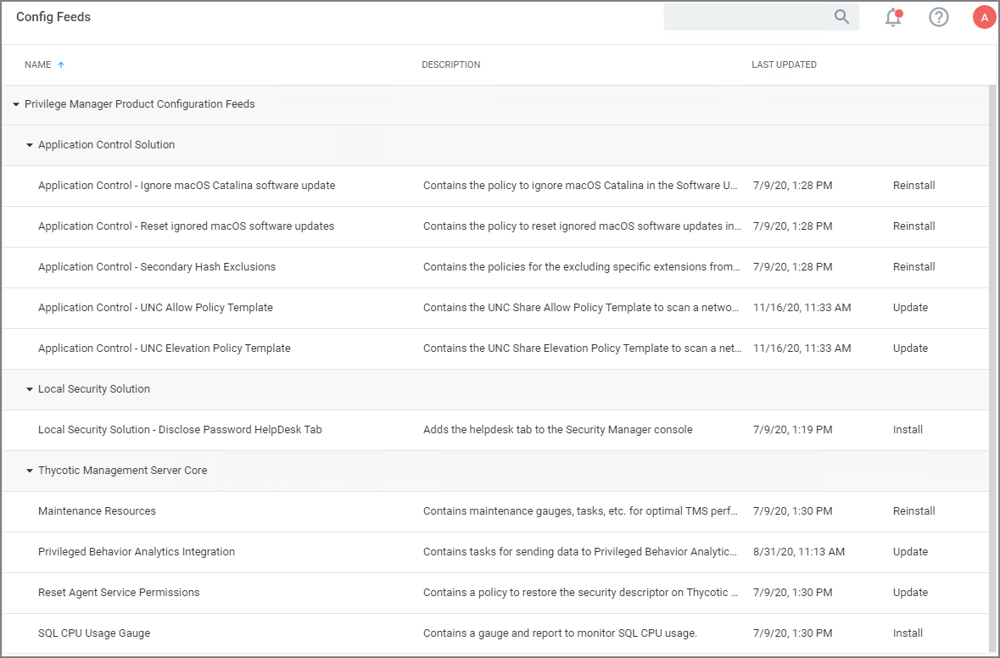

[title]: # (Configuration Feeds)
[tags]: # (adding templates,out-of-the-box)
[priority]: # (2)
# Configuration Feeds

Configuration Feeds are extensions to Privilege Manager. They allow Thycotic to deliver new components/items to Privilege Manager on demand. Simply click through the options in the Config Feeds page. 

1. Navigate to __Admin | Config Feeds__.
1. Browse the available config feeds by expanding __Privilege Manager Product Configuration Feeds__.
   
1. starting with the Select Items button and download anything that might be useful in your environment. Once the item is downloaded, it is immediately available in your Privilege Manager instance.

The main product areas covered are:

* Application Control Solution
* Local Security Solution
* Thycotic Management Server Core

| Solution | Feed | Description |
| ----- | ----- | ----- |
| Application Control Solution | [Ignoring macOS Updates](../tasks/client/ignore-os-updates.md) | Contains the policy to ignore macOS Catalina in the Software Update preference pane. Only works with the KEXT agent and Catalina, not supported with SYSEX agent or on Big Sur and up. |
| |[Reset ignored macOS Software Updates](../tasks/client/ignore-os-updates.md) | Contains the policy to reset ignored macOS software updates in the Software Update preference pane. |
| | [Secondary File Hash Exclusion Policy](../tasks/client/exclude-from-file-hash.md) | Policy template to exclude non-executable files from the hash process. |
| | UNC Allow Policy Template | Contains the UNC Share Allow Policy Template to scan a network share and automatically allow files in MSI, ISO, ZIP files. |
| | [UNC Elevation Policy Template](../../computer-groups/app-control/examples/elevate/network-share.md) | Contains the UNC Share Elevation Policy Template to scan a network share and automatically elevate MSI and EXE files. |
| Local Security Solution |  Disclose Password HelpDesk Tab | Adds the helpdesk tab to the Security Manager console. |
| Thycotic Management Server Core | Maintenance Resources | Contains maintenance gauges, tasks, etc. for optimal TMS performance. |
| | [Privileged Behavior Analytics Integration](../config/foreign-systems/thycotic/set-up-pba.md) | Contains tasks for sending data to Privileged Behavior Analytics (PBA) - requires a SysLog Foreign System to be configured. |
| | [Reset Agent Service Permissions](../../agents/win/pre-10.7.1-agent-hardening.md) | Contains a policy to restore the security descriptor on Thycotic Services for Privilege Manager versions prior to 10.7.1. |
| | SQL CPU Usage Gauge | Contains a gauge and report to monitor SQL CPU usage. |

## Installation, Reinstallation, and Updates

There are three potential options for each of the Configuration Feeds.

* Install: This is the available option for new configuration feeds or when the configuration feed has not previously been installed on the Privilege Manager instance.
* Reinstall: This option is shown when the configuration feed has previously been installed on the Privilege Manager instance.
* Update: This option is shown when the configuration feed has previously been installed on the Privilege Manager instance and an update to the configuration feed is available.  

