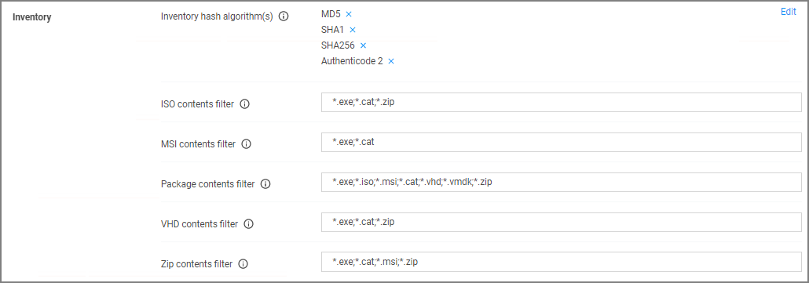

[title]: # (File Inventory)
[tags]: # (general configuration)
[priority]: # (5)
# File Inventory Solution

Under the File Inventory Solution the inventory hash algorithm(s) and file extensions used for inclusions and exclusions are specified.

* Inventory hash algorithm(s) are the default hash algorithms used for resource inventory. This setting will be used for server-based inventory, and also agent-based inventory unless overridden by agent configuration.
* ISO contents filters with default extensions of .exe, .cat, and .zip.
* MSI contents filters with default extensions of .exe, and .cat.
* Package contents filters with default extensions of .exe, .iso, .msi, .cat, .vhd, .vmdk, and .zip.
* VHD contents filters with default extensions of .exe, .cat, and .zip.
* ZIP contents filters with default extensions of .exe, .cat, . msi, and .zip.

When you click __Edit__ you can add other hash algorithms to the list. You can change any of the listed file extensions by adding/removing directly in the text fields. Make sure to save any changes.

