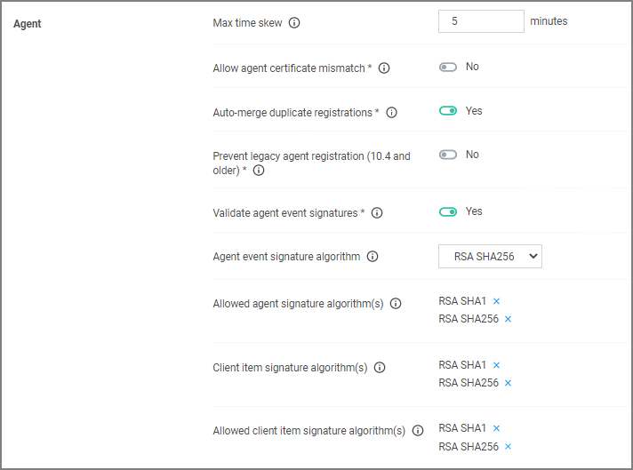

[title]: # (Agent)
[tags]: # (general configuration)
[priority]: # (4)
# Agent

Under the Agent section the agent related general configuration items can be specified.

## Max time skew

This setting specifies the maximum time difference (in minutes) to allow client system clocks to be out of sync with the server.

## Allow agent certificate mismatch

Enabling this setting, allows agents to communicate with the server even if there is a certificate mismatch.

## Auto-merge duplicate registrations

By default this setting is enabled. The setting controls whether or not duplicate SIDs detected during agent registration are automatically merged.

## Prevent legacy agent registration (10.4 and older)

Enabling this setting prevents older agents (prior to 10.5) from registering, allowing only agents with valid agent Install Codes. Only enable this option if you are certain your managed computers have all been upgraded to 10.5 or newer agents.

## Validate agent event signatures

By default enabled, this setting will verify the signature contained within agent events are sent to the server. Any events with invalid signatures are discarded.

## Agent event signature algorithm

The default signature algorithm agents will use when sending events to the server. Agents 11.1 and newer will use this setting, older agents will use RSA SHA1.

## Allowed agent signature algorithm(s)

This setting specifies the algorithm(s) the server should accept for agent event signatures. SHA1 should be left enabled if agents older than 11.1 are in the environment.

## Client item signature algorithm

This setting specifies the algorithm(s) used to sign client items that are sent to agents. SHA1 should be left enabled if agents older than 11.1 are in the environment.

## Allowed client item signature algorithm(s)

This setting specifies the algorithm(s) the agent should accept for client item signatures. Agents 11.1 and newer will use this setting, older agents will use RSA SHA1.
