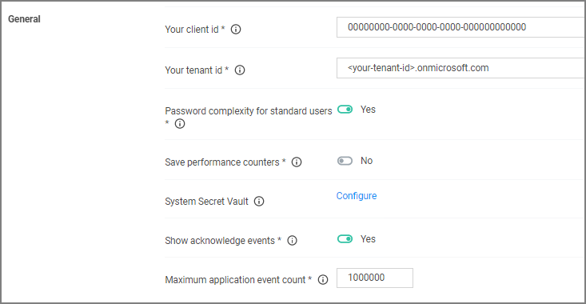

[title]: # (General Settings)
[tags]: # (general configuration)
[priority]: # (2)
# General System Settings

Under the Privilege Manager Server category, the first section is General settings.

## Your client id

This client id is used by __mobile devices__ for authentication.

## Your tenant id

This tenant id is used by mobile devices for authentication.

## Password complexity for standard users

This setting is set to yes by default, meaning the password complexity rules are enforced when creating or editing a Privilege Manager user resource.

Refer to [Password Complexity Enforcement](../../users/pw-complexity.md) for further details.

## Save performance counters

If this setting is selected, the performance counter data will be recorded in the database. Also refer to [Delete Old Performance Counter Events](../../tasks/maintenance.md#delete_old_performance_counter_events).

## System Secret Vault

This link lets you configure the foreign system used to store secrets.

## Show acknowledge events

If selected then the acknowledge events button will be visible in Policy Events.

1. Set the switch to Yes to enable the acknowledge events button.

Once you save the changes, you will see an Acknowledge All button on the Policy Events grid after selecting an unacknowledged event.

## Maximum application event count

This setting specifies the Maximum number of application action events that will be kept in the database. The default setting is 1,000,000. Also refer to [Purge Maintenance - Application Control Events](../../tasks/maintenance.md#purge_maintenance___application_control_events).
