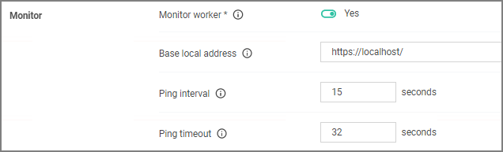

[title]: # (Monitor Settings)
[tags]: # (general configuration)
[priority]: # (3)
# Monitor Settings

Under the Privilege Manager Server category, the second section is Monitor settings. The Monitor setting is designed to monitor the Worker Role to ensure it is healthy and active. When enabled, the process checks the health at each Ping Interval and waits until the Timeout value before considering it unhealthy.

## Monitor Worker Role

When this setting is enabled the health of the monitor process will be polled.

## Ping Interval

Specifies how often the server will attempt to contact the Monitor process to query its health. The default is set to 15 Seconds. 

## Base Local Address

This setting specifies the base URL of the Monitor process.

## Timeout

Specifies how long the server process will wait to hear back from a ping request to the Monitor process. The default is set to 30 Seconds.
