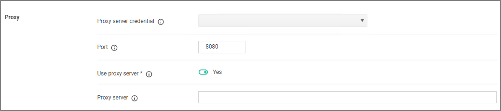

[title]: # (Proxy Settings)
[tags]: # (general configuration)
[priority]: # (6)
# Proxy Settings

Under the Privilege Manager Server category, the third section is Proxy settings.

## Proxy Server

This setting specifies the name or IP address of the proxy server.

## Proxy Server Credential

This link lets you configure the credential used to authenticate with the proxy server.

## Port

This setting specifies the port used for communications to the proxy server.

## Use Proxy Server

If set, communications will be done via the proxy server specified.
