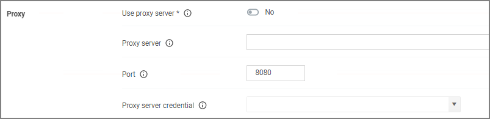

[title]: # (Proxy Settings)
[tags]: # (general configuration)
[priority]: # (7)
# Proxy Settings

The proxy configuration settings are used when a reverse proxy is used with your Privilege Manager instance.

## Use proxy server

If set, communications will be done via the proxy server specified.

## Proxy server

This setting specifies the name or IP address of the proxy server.

## Port

This setting specifies the port used for communications to the proxy server.

## Proxy Server Credential

This link lets you configure the credential used to authenticate with the proxy server.
