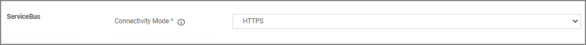

[title]: # (ServiceBus Settings)
[tags]: # (general configuration)
[priority]: # (6)
# ServiceBus Settings

Under the Privilege Manager Server category, the fourth section is ServiceBus settings.

## Connectivity Mode

This setting specifies the connectivity mode for Service Bus. The default is HTTPS, which is also recommended.
