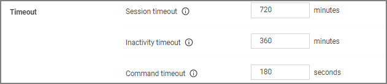

[title]: # (Timeout)
[tags]: # (general configuration)
[priority]: # (3)
# Timeout

These settings specify the system timeout behaviors.

## Session Timeout

This setting specifies the maximum time in __minutes__ for a login session to be active without having to negotiate another token. The default is set to 720 Minutes (12 Hours).

### Session Timeout Warning

Two minutes before the set session timeout window expires, Privilege Manager displays a yellow warning with countdown timer to inform users about the pending session timeout.

## Inactivity Timeout

This settings specifies the maximum allowed time for inactivity when logged into the Privilege Manager console. The default is set to 30 Minutes. The session token remains active and does not need to be renegotiated when the inactivity timeout happens within the specified session timeout window.

## Command Timeout

This settings specifies the SQL command timeout. The default is 180 Seconds.