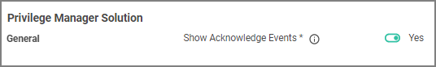
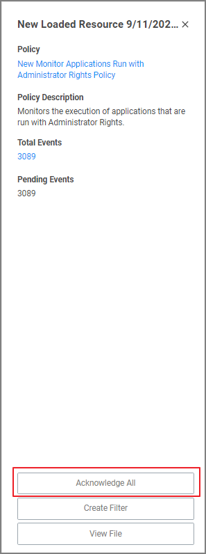

[title]: # (PM Solution)
[tags]: # (general configuration)
[priority]: # (7)
# Privilege Manager Solution

If selected then the acknowledge events button will be visible in Policy Events.

1. Set the switch to Yes to enable the acknowledge events button.

   

Once you recycle the application pool, you will see an Acknowledge All button on the Policy Events grid after selecting an unacknowledged event.

