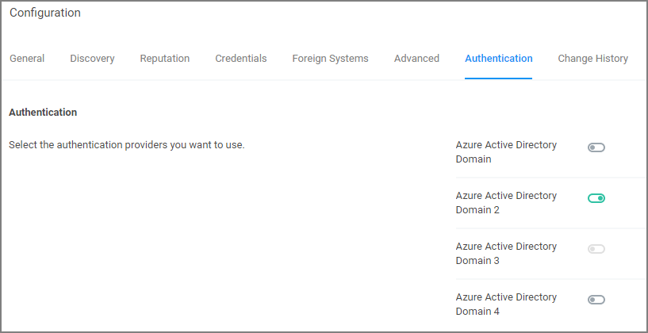

[title]: # (Authentication Tab)
[tags]: # (authentication provider)
[priority]: # (1)
# Authentication Tab

The Authentication tab is used for setting up the Authentication Provider used with Privilege Manager. Different authentication providers can be setup based on configured Foreign Systems. The user logs in based on the active authentication provider. Only one authentication provider can be active at any given time.

>**Note**:
>If you are trying to change your Authentication Provider specifically to NTLM, Privilege Manager runs a verification to make sure the local build-in Administrators Group is in the Privilege Manager Administrators Role.
