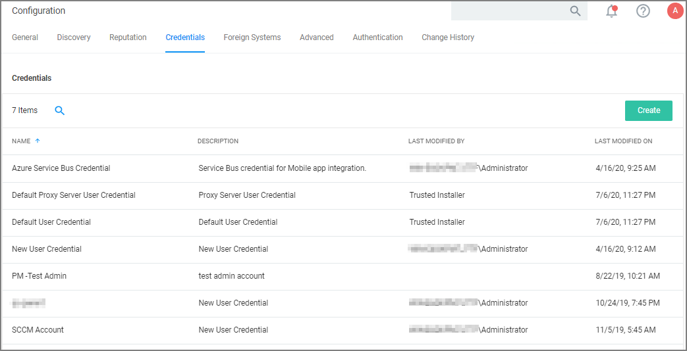

[title]: # (Credentials Tab)
[tags]: # (admin,configuration)
[priority]: # (1)
# Credentials Tab

The Credentials tab lets you configure and add new credentials required for configured Foreign Systems.

1. Navigate to __Admin | Configuration__ and select the __Credentials__ tab.
1. Click __Create__ to add a new credential.

   
