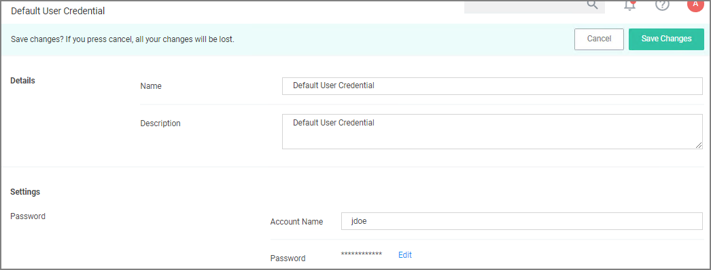
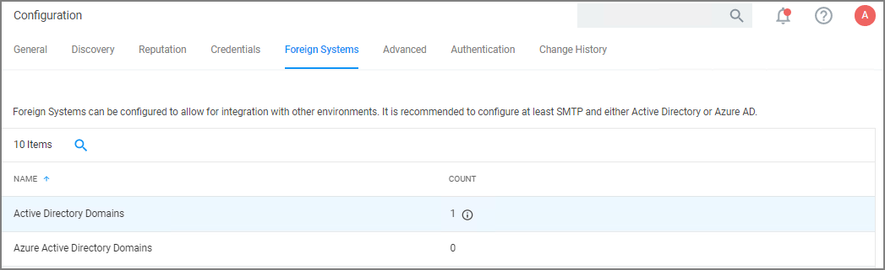
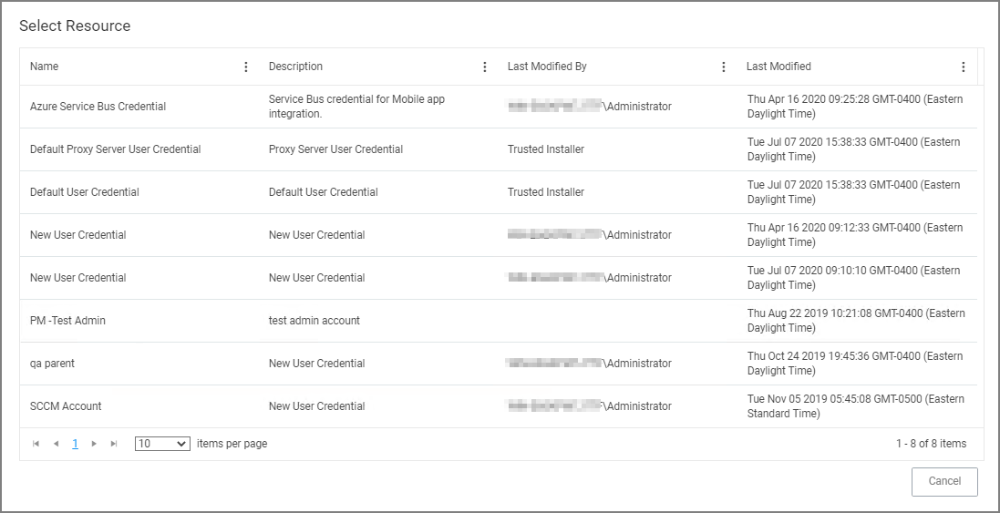
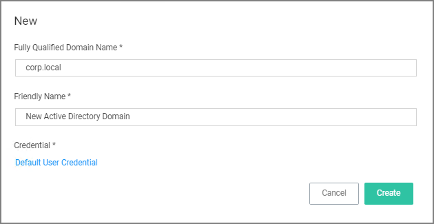
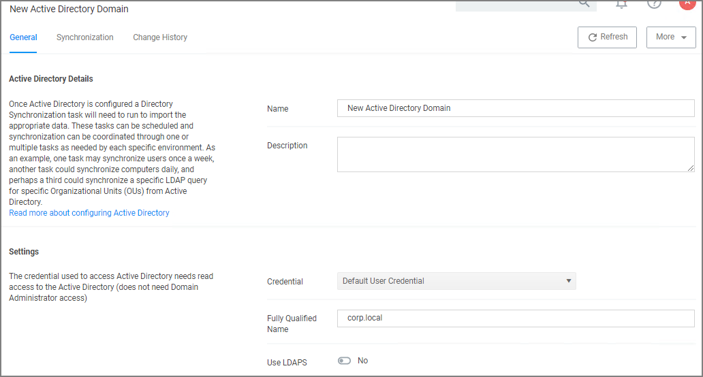
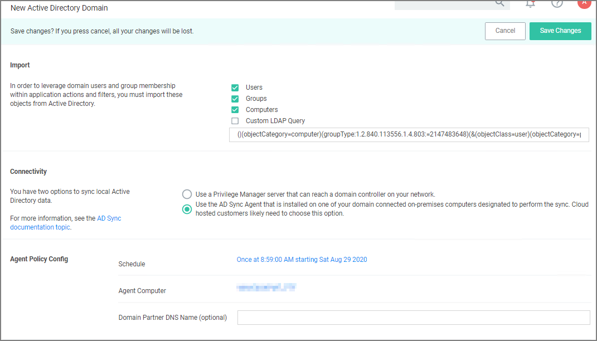
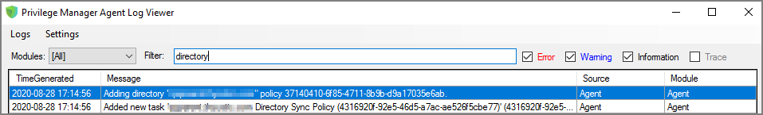
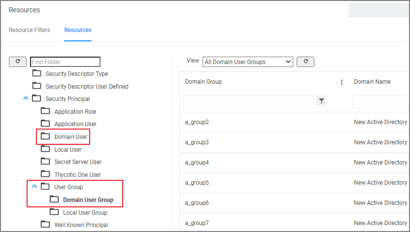

[title]: # (Active Directory Synchronization)
[tags]: # (setup)
[priority]: # (3)
# Active Directory Synchronization

The following procedures show the steps necessary to set-up Active Directory synchronization in Privilege Manager.

If you already configured the AD Default User Credential skip to the Foreign Systems set-up procedure.

>**Note**: For local AD synchronization with Privilege Manager cloud the Directory Services Agent has to be installed. We recommend [installing the Directory Services Agent](../../../../install/agents/agent-inst-win-dsa.md) on a system that already has the Thycotic Agent (Core Agent) installed; however you may also use a domain connected system and newly install both the Core and Directory Services Agent by using the [bundled installer](../../../../install/agents/agent-inst-win-dsa-bundle.md).

## Set-up AD Default User Credential

1. Select __Admin | Configuration__.
1. Select the __Credentials__ tab.
1. Edit the __Default User Credential__ or use __Create__ to add a new user. Set a domain credential with an Account Name and Password that has can read from the Active Directory domain(s).

   
1. Click __Save Changes__ and continue with step 2 in the Foreign Systems set-up procedure.

## Setup Foreign Systems

1. Select __Admin | Configuration__.
1. Select the __Foreign Systems__ tab.
1. Select Active Directory Domains.

   
1. On the Active Directory Domains page, select __Create__.
1. Enter a fully qualified domain name and a friendly name.

   
1. Under the required Credential click __Select...__.

   
1. From the Resources page select a credential.

   
1. Click __Create__.

   
1. Verify the __URL__ (Fully Qualified Name) is correct.
1. If the domain uses LDAPS, set the switch to enable.
1. Click __Save Changes__.
1. Once Active Directory is configured a Directory Synchronization task needs to run to import the appropriate data. Select the __Synchronization__ tab.

   
1. Select the task(s) you want to perform:
   1. Import:
      * Users
      * Groups
      * Computers
      * Custom LDAP Query
   1. Connectivity, via either
      * __Privilege Manager server__ that can reach a domain controller on your network:
        1. Synchronization Task Config:
           * Schedule - Schedules help keeping your system in sync with your domain updates.
           * Domain Partner (optional)
        1. Click __Save Changes__.
        1. Click __Run__, to manually run the task on demand.
      * __[Directory Services Agent](../../../../install/agents/agent-inst-win-dsa.md)__ that is installed on one of your domain connected on-premises computers designated to perform the sync. Cloud hosted customers likely need to choose this option.

        
        1. Under __Agent Policy Config__:
           * Schedule: Schedules help keeping your system in sync with your domain updates.
           * Agent Computer: Select the computer that has the Thycotic Core and Directory Services Agents installed.
           * Domain Partner (optional)
        1. Click __Save Changes__.

           By setting this up via Directory Services Agent, the directory policy and the Directory Sync Policy task are applied to the agent, which based on the task schedule kicks off the local active directory synchronization. You can verify this by checking your Agent logs.

           

Tasks can be scheduled and synchronization can be coordinated through one or multiple tasks as needed by each specific environment. As an example, one task may synchronize users once a week, another task could synchronize computers daily, and perhaps a third could synchronize a specific LDAP query for a specific group from Active Directory.

## Viewing Imported Users and Groups

You may verify and browse the users and groups that are expected to be imported from Active Directory.

1. In Privilege Manager, navigate to __Admin | Resources__.
1. Expand __Organizational Views__.
1. Expand __Default__.
1. Expand __All Resources__.
1. Expand __Security Principal__.
   1. Select __Domain User__. You should see a list that contains imported Active Directory users.
   1. Select __User Group__. You should see a list that contains imported Active Directory groups (other groups may exist in the list as well).

   
