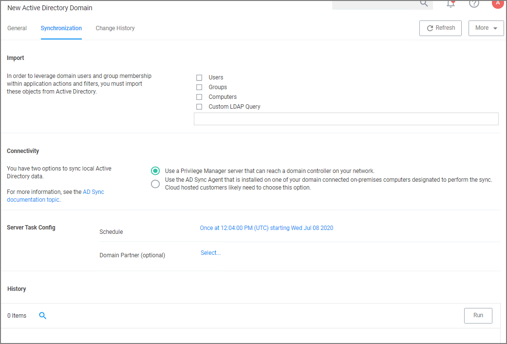
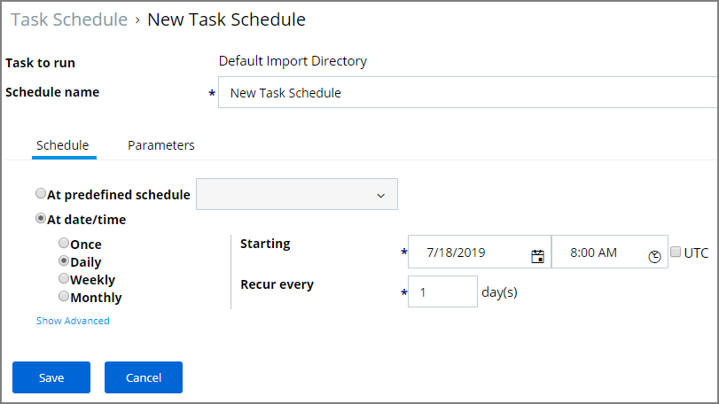

[title]: # (Active Directory Synchronization)
[tags]: # (setup)
[priority]: # (3)
# Active Directory Synchronization

The following procedures show the steps necessary to set-up Active Directory synchronization in Privilege Manager.

If you already configured the AD Default User Credential skip to the Foreign Systems set-up procedure.

>**Note**: For local AD synchronization with Privilege Manager cloud the Directory Services Agent has to be installed. We recommend [installing the Directory Services Agent](../../../../install/agents/agent-inst-win-dsa.md) on a system that already has the Thycotic Agent (Core Agent) installed; however you may also use a domain connected system and [newly install both the Core and Directory Services Agent](../../../../install/agents/agent-inst-win-dsa-bundle.md).

## Set-up AD Default User Credential

1. Select __Admin | Configuration__.
1. Select the __User Credentials__ tab.
1. Edit the __Default User Credential__ or use __Create__ to add a new user. Set a domain credential with an Account Name and Password that has can read from the Active Directory domain(s).

   
1. Click __Save Changes__ and continue with step 2 in the Foreign Systems set-up procedure.

## Setup Foreign Systems

1. Select __Admin | Configuration__.
1. Select the __Foreign Systems__ tab.
1. Select Active Directory Domains.

   
1. On the Active Directory Domains page, select __Create__.
1. Enter a fully qualified domain name and a friendly name.

   
1. Under the required Credential click __Select...__.

   
1. From the Resources page select a credential.

   
1. Click __Create__.

   
1. Verify the __URL__ is correct.
1. If the domain uses LDAPS, set the switch to enable.
1. Click __Save Changes__.
1. Once Active Directory is configured a Directory Synchronization task needs to run to import the appropriate data. Select the __Synchronization__ tab.

   
1. Select the task(s) you want to perform:
   1. Import:
      * Users
      * Groups
      * Computers
      * Custom LDAP Query
   1. Connectivity, use either
      * a Privilege Manager server that can reach a domain controller on your network, or
      * the [AD Sync Agent that is installed](../../../../install/agents/agent-inst-win-dsa.md) on one of your domain connected on-premises computers designated to perform the sync. Cloud hosted customers likely need to choose this option.
   1. Server Task Config:
      * Schedule - Schedules help keeping your system in sync with your domain updates.
      * Domain Partner (optional)
1. Click __Save Changes__.
1. Click __Run__, to manually run the task on demand.

These tasks can be scheduled and synchronization can be coordinated through one or multiple tasks as needed by each specific environment. As an example, one task may synchronize users once a week, another task could synchronize computers daily, and perhaps a third could synchronize a specific LDAP query for a specific group from Active Directory.

<!--
## Setting up Scheduled Synchronization Task

1. Select __Admin | More__.
1. Select the __Tasks__ link.
1. Navigate the Jobs and Tasks tree and open __Server Tasks | Directory Services__.
1. Use the following three templates to run a task on demand and to customize schedules based on your company needs:
   * Default Import Directory
   * Default Import Directory Computers
   * Default Import Directory Sites

     
1. Click __View__ on the template task.
1. Click __Create a Copy__ and give it a name, click __Create__.
1. Click __Edit__ on the newly created task.
   * On the __General__ tab, you can change the task name and customize the Description.
   * On the __Parameters__ tab,
     1. Click __Select Resource__ to specify the Directory Id and Directory partner ID.
     1. You may provide a Full sync Query and specify Search Configuration.
   * On the __Schedules__ tab,
     1. Click New Schedule to set-up a customized synchronization schedule.

        
   * Click __Save__.
1. You may manually run the task now or wait for the schedule to kick in. -->

## Viewing Imported Users and Groups

You may verify and browse the users and groups that are expected to be imported from Active Directory.

1. In Privilege Manager, navigate to __Admin | Resources__.
1. Expand __Organizational Views__.
1. Expand __Default__.
1. Expand __All Resources__.
1. Expand __Security Principal__.
1. Select __Domain Users__. You should see a list that contains imported Active Directory users.
1. Select __User Group__. You should see a list that contains imported Active Directory groups (other groups may exist in the list as well).
